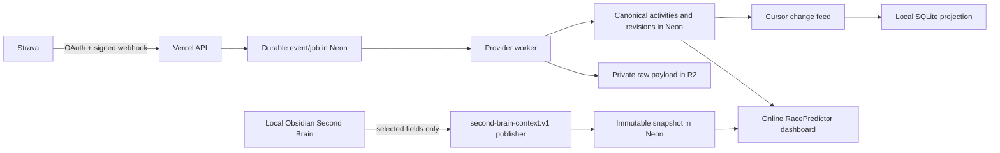

# ADR 0003: Cloud Strava ingestion and selected Second Brain sync

- **Status:** Accepted for implementation
- **Date:** 2026-08-10
- **Decision owners:** Product Owner and RacePredictor delivery team

## Context

RacePredictor must be online and automatically receive completed workouts. The initial provider is Strava. The local Obsidian Second Brain remains valuable, but the online service must not depend on the local computer being available and must never receive an entire vault.

The initial product is intentionally simple for one owner and one athlete. Its data and authorization boundaries must nevertheless be athlete-scoped so a later multi-athlete product does not require a re-architecture. The first release uses free-tier services only.

## Decision

Use a cloud-authoritative, provider-neutral architecture:

- **Vercel Hobby** hosts the Next.js dashboard and HTTP endpoints.
- **Neon Postgres** is authoritative for normalized activities, approved plans, calendars, provider state, sync state, and immutable Second Brain snapshots.
- **Cloudflare R2** privately retains raw provider payloads and files; Neon stores metadata, checksums, and object keys only.
- **Strava** is the only provider adapter implemented now. Garmin and other providers join later through the same adapter interface.
- **Obsidian stays local and authoritative only for qualitative source material.** A local agent publishes an immutable `second-brain-context.v1` snapshot containing an explicit, strict allow-list of selected structured fields.
- The local agent also pulls cloud changes into a SQLite projection through a durable cursor. It never needs to upload the vault.
- All cloud application operations require an authenticated actor and athlete scope. Until the owner configures a production identity provider in M8, production-mode cloud routes fail closed; test/local adapters may use explicit synthetic actors only.

## Selected Second Brain contract

`second-brain-context.v1` is a separate contract from `coaching-context.v1`. It is strict at both publisher and API boundaries and contains only:

- `schemaVersion`, `athleteId`, monotonic `revision`, `publishedAt`, and deterministic `contentHash`;
- `selectedFields`, whose values can only name the contract sections actually present;
- structured availability, training preferences, dated constraints, wellbeing check-ins, and activity reflections explicitly named by the contract.

Version 1 has no arbitrary free-text field. It rejects unknown fields and does not permit goals or plan prescriptions, event names, Markdown, note bodies/titles, backlinks, attachments, local paths, vault identifiers, credentials, executable content, raw provider payloads, or plan lifecycle instructions. Goals and approved plans remain cloud-authoritative. Snapshots are immutable. A snapshot may inform display or a later explicitly requested planning workflow, but cannot create, edit, approve, activate, or adapt a training plan.

## Provider-neutral and athlete-safe boundaries

Core owns interfaces for `ActorContext`, `ProviderAdapter`, `ProviderConnectionRepository`, `ActivityRepository`, `RawObjectStore`, `JobQueue`, `SyncRepository`, and `SecondBrainSnapshotRepository`. Implementations live in database/app infrastructure. Every record and method receives `athleteId`; repositories authorize the actor before accessing a row, object key, signed URL, event, device, or snapshot.

The one-athlete UI has no athlete selector, invitations, or role-management screens. The schema includes `User`, `Athlete`, and `AthleteAccess`, and every owned entity is directly athlete-scoped or reaches one through an enforced parent relation.

## API and persistence outline

Additive `/api/v1` endpoints cover health, session/actor state, Strava connection lifecycle, Strava webhook receipt, connection/ingestion status, cursor changes, paired device registration/revocation, Second Brain snapshot publication/latest status, and cloud-backed activity/dashboard reads. No raw object is exposed without athlete authorization and a short-lived signed URL.

Neon adds provider connection, webhook receipt, ingestion job, raw object metadata, source reference, activity revision, sync change, paired device, and Second Brain snapshot records. Unique keys include athlete scope plus provider identifiers or idempotency values. Raw payload bodies remain in R2.

## Reliability, cost, and failure behavior

- Webhook receipt validates verification/signature material, records idempotently, and acknowledges quickly. A worker performs provider fetch, R2 write, normalization, and change-feed append.
- Retries are classified and durable. Duplicate deliveries and replay create one logical activity. A bounded daily reconciliation recovers missed events.
- Token refresh, rate limits, provider outages, R2 failure, and database failure surface a truthful retrying/failed state; they never claim a current workout.
- R2 object access is private by default. Checksums and metadata prove raw-payload traceability.
- Vercel/Neon/R2 free-tier limits mean cold starts and delayed recovery are possible. The product targets recoverability and clear freshness state, not a service-level guarantee. Feature flags can disable provider ingestion without deleting canonical historical data.

## Alternatives considered

| Alternative | Why not selected |
|---|---|
| Keep all automation on the local machine | The online dashboard would be stale whenever the local machine is off. |
| Send the full Obsidian vault to the cloud | Violates the selected-field and privacy boundary, increases risk and cost. |
| Build Garmin first | Garmin-specific work is outside this phase; Strava has the required first integration path. |
| Store raw payloads in Neon | Consumes scarce database capacity and couples payload retention to query storage. |
| Model only a hard-coded athlete | Creates an authorization and migration trap for future athletes. |
| Add multi-athlete UI now | Expands MVP without improving the one-owner outcome. |

## Consequences

Positive: RacePredictor remains online without the local computer; automatic import is durable and traceable; the Second Brain boundary is privacy-preserving; future providers/athletes have safe seams.

Costs: additional persistence, queue, object-store, and authentication code; two freshness concepts must be clearly shown; M8 requires owner sign-in to provision Vercel, Neon, R2, and Strava credentials. Phase 1 manual imports and local coaching workflows remain supported during migration and must keep passing their existing regression tests.

## Delivery sequence

M1 confirms scope, this ADR, contracts, and tests. M2 adds cloud contracts, tenancy-safe persistence, storage/auth seams. M3 adds Strava ingestion. M4 switches online reads and visible freshness states. M5 adds local selected-field publication and cursor pull. M6 hardens and runs end-to-end QA. M7 records Product Owner acceptance. M8 performs owner-authenticated provisioning and production smoke tests.
