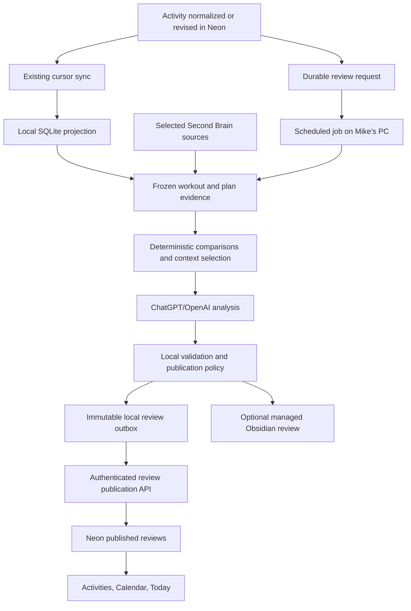

# Activity coach feedback — end-to-end architecture proposal

Status: Proposed design; no implementation, deployment, automation creation, or approved-scope change.  
Date: 2026-09-08  
Companion: [UX design and wireframe](../design/ACTIVITY_COACH_FEEDBACK_UX.md).

## Problem Framing

**Goal:** Generate personal, evidence-based coaching feedback for newly available running activities, compare each with applicable planned work, incorporate selected local Second Brain knowledge, and publish a readable review into RacePredictor.

**Confirmed:** Processing must be coordinated on Mike's local computer. Mike confirmed that selected workout and knowledge-base context may be sent to ChatGPT/OpenAI for analysis. Delayed scheduled execution is acceptable. This request is design-only.

**Constraints:** Preserve the existing cloud/local authority boundaries, additive APIs, deterministic ingestion/deduplication, athlete scoping, and explicit plan approval. Feedback must never block a workout import, be mistaken for workout completion, or activate/adapt a plan.

**Assumptions:** The knowledge base is the documented Obsidian Second Brain; actual configured paths and note selection remain to be verified at setup. Start with running sports already represented by the activity contract. Use a local desktop scheduled task as the first generation adapter, with an API-backed local worker as an alternative. No specific model or GPU is required by this design.

**Open configuration choices:** Exact notes/headings allowed for AI use; cadence and review budget; model/provider configuration; historical backfill range. Recommended defaults are below. They are proposed values, not existing behavior.

## Requirements Check

| Requirement | Design response / acceptance boundary |
|---|---|
| Coaching prose after a workout | Versioned review containing specific assessment, plan comparison, training context, one next action, and material evidence limitations |
| Local knowledge base | Local source selector prepares bounded, dated context; only selected material reaches AI |
| Feedback visible online later | Durable review request, local generation, validated publication into Neon, owner read APIs |
| Reliable comparison with plan | Explicit association status; compare the effective session while retaining approved prescription and amendments |
| Computer can be off | Cloud activity remains available; request waits and is processed after the runner resumes |
| No implementation now | New proposal documents only; current specs and operational configuration remain untouched |

The current context, ADR 0002, and cloud programme explicitly exclude automatic reviews/adaptation. This design proposes adding **automatic observational reviews** as a new slice; autonomous plan/calendar changes remain excluded. ADR 0006's fixed structured publisher remains unchanged. Reading selected prose for this new local reviewer requires a separate, explicit source boundary.

## Architecture Overview

### Verified current system

| Existing asset | Reuse | Gap to address |
|---|---|---|
| Vercel Next.js app, Neon canonical records, private R2 raw storage | Existing ingestion, owner authentication, activity reads | No durable workout-review feature |
| Paired-device cursor sync and SQLite projection | Activities, plan/calendar revisions, device identity, replay-safe local data | New review requests/publications need their own compatible transport |
| `ActivityDetail` and its synced payload | Metrics, optional sensors and per-kilometre splits | A populated DTO field is not proof a particular provider supplied it |
| `cloud_activity_mappings` | Resolve cloud identity against locally deduplicated records | Review publication must use the canonical cloud activity ID |
| `PlannedWorkout` | Duration, optional distance/RPE, purpose, prose prescription | No typed interval blocks, target pace ranges, or HR-zone prescription |
| `coaching-review-context.v1` | Reuse concepts of prescribed/effective sessions and amendment audit | Current builder filters to future dates and is not a post-workout input |
| Strict `second-brain-context.v1` | Selected availability, preferences, constraints, wellbeing, activity reflections | No prose or arbitrary notes allowed; do not broaden this schema |
| Scheduled local sync, default 15 minutes | Keep fast sync/publication separate from AI | Do not hold a sync run open for model reasoning |
| Shared `ActivityRecordContent` in Activities and Calendar | One review presentation with independently loaded state | Today preview, comparison controls, and review-specific states are new |

Evidence inspected: `docs/CONTEXT.md`, `docs/ARCHITECTURE.md`, `docs/design/screens.md`, `docs/UI_UX_SPEC.md`, `docs/UI_GUIDELINES.md`, `docs/LOCAL_GARMIN_SECOND_BRAIN.md`, cloud architecture, ADRs 0002/0004/0006, Calendar UX proposal, relevant core contracts/services, activity/Calendar components, local sync/projection, and device authentication code. `.codex/enforcement` was absent. `apps/web/AGENTS.md` was read; no application code is being written.

### Proposed flow

### Key Design Decisions

1. **Keep ingestion and AI execution independent.** A canonical change creates cheap durable review work; model processing happens later on the PC. The scheduler is a wake-up mechanism, never the queue of record.
2. **Use a structured exchange, consistent with existing coaching.** New `activity-review-context.v1` and `activity-coach-review.v1` artifacts separate facts from generation. No direct model writes to databases or plans.
3. **Store published reviews in Neon.** They remain readable while the PC is off. SQLite owns local job state, evidence manifests, and retry outbox; it does not become a second cloud activity authority.
4. **Keep the full local evidence separate from the published review.** The local runner can use approved prose; the cloud receives bounded derived coaching text and safe evidence references. Existing selected-context JSON remains strict and unchanged.
5. **Use the current active plan for new comparisons.** This respects the existing Calendar policy. Freeze the version used, distinguish a current-plan comparison from what was historically prescribed, and never silently substitute retired plans. Previously published reviews retain their original references as labelled history.
6. **Separate association, interpretation, and completion.** Matching a session identifies comparison intent. It does not mark a session completed, award adherence, or update predictions.

## Component Design

| Component / owner | Responsibilities and dependencies | Failure behavior |
|---|---|---|
| Review eligibility and request service — core + DB adapters | Request work after canonical commit, including revisions/deletion; owner refresh; reconcile missing requests | Persist independently of AI; repair missed enqueue without re-importing |
| Cloud review repository — DB | Athlete-scoped requests, associations, leases, immutable published versions, current pointers | Atomic transitions; conflicting revisions return a conflict |
| Local runner — proposed `apps/coach-worker` composition | Synchronize first, discover/claim bounded work, freeze inputs, invoke generation adapter, validate, persist/publish | Expiring lease, bounded attempts and resumable outbox; no ingestion lock during model calls |
| Context and comparison service — core | Match candidates, select history window, compute comparable metrics and evidence IDs | Produce explicit gaps; never fill missing data with invented metrics |
| Local source adapter — infrastructure behind a core port | Read only configured vault files/headings; select dated personal context and optional coaching principles | Optional missing note reduces coverage; missing required source blocks that review with a clear reason |
| Generation adapter — local infrastructure behind a core port | Consume a frozen input and return constrained review content | Timeout/refusal/invalid output becomes a retry or attention state, not published feedback |
| Review validator and publication policy — core + local adapter | Schema, references, numeric consistency, privacy fields, revision preconditions | Reject untrusted/obsolete output; keep prior valid version |
| Publication adapter — local + authenticated web composition | Replay exact persisted output through the device API; acknowledge receipt | Network uncertainty retries the same identity and hash without another model call |
| Review read service / UI — web + core view models | Read lightweight summaries and details independently of activities | Optional review failures never hide activity/plan data |

Core owns contracts, pure policy and ports. DB owns SQL/Prisma and local persistence. The new local application composes filesystem/model/scheduler adapters; it does not import web internals. The browser never calls a model provider or accesses vault paths.

### End-to-end execution

1. **Discover:** A new eligible canonical activity or a material revision creates or supersedes a review request after commit. Use a post-commit enqueue plus reconciliation against existing activity revisions so review infrastructure cannot roll back ingestion. Duplicate provider events reuse the same request. Activity deletion cancels outstanding work and removes visible review pointers.
2. **Claim:** The designated paired device obtains a lease for a bounded batch, including each request's required source cursor. On restart it checks saved outbox work first, renews/reclaims as needed, then resumes. Only a fresh claim can publish; overlapping schedules cannot own the same request simultaneously.
3. **Catch up:** The local job performs the existing bounded pull or waits for its successful completion. Read activity/session payloads only after reaching the request's required cursor. If the page/time budget ends before then, release/defer the claim rather than generate. Renew the lease while legitimately catching up. A failed optional note render or selected-context upload is reported separately from projection readiness.
4. **Freeze:** In a short consistent local read, capture activity content/revision, matching decision, active plan, effective session and amendment revisions, relevant history, and configured source content. Read cloud activity payloads through the projection repository: the synced full detail contains splits even where the normalized local activity table does not materialize them. Resolve IDs via the mapping repository; never guess identity from title/date.
5. **Prepare facts:** Calculate duration/distance deltas, compatible split summaries, recent training totals, and explicit data-coverage flags deterministically. Give every fact a stable ID. The model interprets those facts; it does not calculate the app's comparison table.
6. **Read the Second Brain:** Select bounded relevant excerpts from the local allow-list, store a private manifest with hashes and dates, and create a separate prompt input. Do not let the model browse arbitrary vault paths.
7. **Generate:** The adapter requests a concise coaching review based on the frozen evidence, with traceable claims and no action tools. Output is a draft structured artifact, not authority.
8. **Validate and persist:** Check schema, IDs, claims, values, size and publication policy; recheck local source hashes. Write the exact validated output atomically to SQLite/outbox before making any network publication call.
9. **Publish:** The server authenticates the device, checks the claim and expected current activity/association/plan revisions, and atomically stores the immutable version plus current pointer and job outcome. A changed input returns a conflict and queues a fresh context; a late response cannot replace newer feedback.
10. **Read and retain:** Activities/Calendar read the same published revision; Today reads its preview. Optionally render a managed Obsidian feedback section through a separate outbox. Corrupt note markers cannot undo successful cloud publication or overwrite owner prose.

For local-only manual imports, use the same core workflow with local activity authority and a SQLite review repository. There is no cloud publication until an existing authorized sync flow supplies a verified cloud mapping. This feature must not invent a new activity-upload path or claim local-only data is visible online.

### Job state and recovery

Cloud request states are `pending`, `leased`, `retry_wait`, `published`, `attention_required`, `superseded`, and `cancelled`. Local substates distinguish preparing evidence, generating, validating and awaiting publication. A published review's freshness is a separate property: a new pending request must not erase an existing review. The cloud displays only local substates explicitly reported by a live lease.

Proposed retry policy: transient model/network failures retry at 5, 15 and 60 minutes, subject to the next available run, then require attention; allow at most one repair attempt for invalid model output within a generation attempt. Authentication, unsupported schema and invalid required configuration stop immediately. Expired leases return to pending through bounded reconciliation. Transport publication retries replay the saved artifact and do not consume generation attempts. An explicit owner retry can reopen work after the cause is corrected. Apply a daily generation cap across retries as well as new work.

### Matching and plan comparison

The first release supports one activity associated with at most one planned session, and one confirmed activity per session. Split recordings and multi-session workouts receive general feedback and an explicit limitation; aggregation is a later extension.

- Prefer an existing owner-confirmed association. Otherwise, consider non-rest running-compatible effective sessions on the athlete-local activity date in the current active plan. Exclude skipped sessions and already confirmed associations.
- Exactly one eligible candidate becomes a **suggested** association. Sport/date/time/duration evidence can rank candidates, but similar distance or duration alone never establishes intention or completion.
- Multiple candidates remain ambiguous. Allow an explicit selection from a bounded neighboring-date window (proposed ±7 days) within the active plan; preserve the fact that it was owner-selected. No suitable candidate yields workout-only feedback.
- Compare against the **effective** prescription, and expose differences from the approved original and reasoned amendments. Capture active-plan ID, content hash and session revision.
- After a plan switch, preserve the old review as history and mark its comparison outdated. A new review uses the new current plan or says no applicable session. Do not claim that today's active plan was necessarily the plan in force when an old run occurred.
- Compute structured duration/distance differences only where both values exist. Show moving/elapsed distinctions. RPE requires a recorded reflection; HR alone is not RPE. Prose pace/interval prescriptions may be discussed with explicit source reference but receive no precise compliance score in the MVP.
- Per-kilometre splits are not automatically interval boundaries. Defer repetition-level adherence, time-in-zone, and heat/terrain-adjusted grading until inputs and deterministic derivations are explicitly available.

### Knowledge-base retrieval and coaching quality

Begin with a local source manifest, not a whole-vault vector database. Proposed sources are the documented Running Context note, user-authored personal sections of recent weekly reviews, explicit activity notes, and optionally selected coaching reference material. Allow source groups independently.

The selector uses stable activity IDs first, then explicit dates/tags/headings. Recent-history facts cover the preceding 28 days through the reviewed workout; comparable historical sessions may come from a bounded 90-day window. Later workouts are excluded from retrospective performance claims. “Next step” uses a separately labelled current-calendar snapshot so a delayed review does not recommend a session already in the past.

Each excerpt records a local source ID, hash, selected heading, author/origin, and effective date if known. Preserve chronology: do not apply a recent illness note to a months-old run. Undated or conflicting facts are reported as uncertain. Freshness derives from meaning/dates, not just file modification time. User-authored facts take precedence over generated summaries; approved structured plans remain authoritative for prescriptions.

Exclude generated sync spans and prior AI reviews from source facts by default to prevent self-reinforcing stories. Optional coaching references remain distinct from personal evidence. Notes and activity titles are untrusted data, never instructions to execute tools, reveal files, or mutate plans.

Proposed initial bounds: at most 12 excerpts, 12,000 characters of prose context, 64 KiB input artifact after deterministic history summarization, and 16 KiB output. Preserve mandatory cautions and target-workout evidence; if those cannot fit, fail explicitly instead of silently dropping them. Record truncation of optional context. These are engineering budgets to tune with evaluation, not model limits.

Publish only the review narrative, typed comparison values, limitations, safe evidence categories, and canonical app references. Raw excerpts, vault paths, filenames, private source labels, unrelated people and medical details remain local. The model receives separate reasoning context and publishable fact fields, with instructions to use private context to shape advice without quoting it. Schema checks cannot guarantee semantic non-disclosure: inspect evaluation outputs for paraphrase leakage; quarantine suspicious output and allow a local-preview mode until the policy is trusted.

The review must distinguish observation, interpretation and recommendation. It must not diagnose, assert causation from missing measurements, prescribe treatment, or invent changes to race predictions. No generic warning banner is needed on every workout; limitations should be specific to the evidence.

### Scheduling and generation options

| Option | Fit | Decision |
|---|---|---|
| Local desktop ChatGPT/Codex scheduled task using constrained review tools/artifacts | Uses the user's existing AI workflow and local notes; tolerates delayed feedback | Recommended first adapter |
| Windows scheduled local worker calling OpenAI API | Stable application-owned execution and explicit API budget; independent of desktop app runtime | Alternative if unattended desktop runs prove unreliable; API credentials and billing are a separate setup choice |
| Web-only scheduled ChatGPT task | Does not directly access the PC's folder | Not the primary local-vault path; would require a separate connected bridge |
| Fully local model | Could implement the same generation port | Unnecessary for the confirmed requirement; not selected or sized here |

Official documentation says desktop scheduled tasks can use local projects while the computer is on and the app is running; web tasks cannot directly work in a folder on the PC. Therefore this design makes no always-on guarantee for the desktop adapter. See [OpenAI scheduled tasks documentation](https://learn.chatgpt.com/docs/automations?surface=app), checked 2026-09-08.

Proposed starting cadence: hourly, `Africa/Johannesburg`, separate from existing 15-minute sync. A manual run consumes the same queue. Process up to five activities per run, newest eligible workouts first, with ageing so old pending work eventually runs. Default lease: 15 minutes, renewed while working; request timeout and batch budget must fit the scheduler/runtime behavior verified at setup. Use per-run serialization and no SQLite transaction around network/model calls.

The scheduled prompt should resolve current pending work on every run, invoke bounded prepare/generate/submit operations, avoid source-code edits, leave the queue intact on failure, and remain quiet when nothing changed. Persist no training facts solely in chat memory. Use a durable configured local data directory, not ephemeral worktree-relative `.local` state. Confirm scheduler execution with a manual end-to-end run before labeling it active. This design does not create that schedule.

## Data Model

All names below are proposals, not existing tables.

| Entity | Location and key fields |
|---|---|
| `ActivityReviewPreference` | Cloud: athlete, enabled, designated device, requested cadence/timezone, auto-review start time, refresh policy; local source settings remain local |
| `ActivitySessionAssociation` | Cloud (SQLite in local mode): athlete/activity, nullable plan/session, state `suggested/confirmed/unplanned/ambiguous`, reason, actor, revision, timestamps |
| `ActivityReviewRequest` | Cloud: athlete/activity, requested activity revision, association revision, reason, source cursor, generation sequence, state, lease owner/token/expiry, attempts, retry time, safe error, created/updated time |
| `ActivityCoachReview` | Cloud: review ID, athlete/activity, generation sequence, input fingerprint, schema/prompt/model/derivation versions, safe content, comparison IDs/revisions, evidence-coverage flags, generated/published time, supersedes ID |
| `ActivityReviewCurrent` | Cloud: unique athlete/activity pointer, current review ID, stale reasons, state revision; old immutable review bodies remain addressable |
| `ActivityReviewReadState` | Cloud: owner/review revision last opened; independent of generation status |
| `LocalReviewContext` | SQLite + private artifacts: exact input, local manifest/excerpts, hashes, cursor, cloud/local identity mapping, retention deadline |
| `LocalReviewOutbox` | SQLite: immutable review output/identity/hash, expected revisions, request ID, attempt metadata, cloud acknowledgement |
| `LocalReviewSourceConfig` | Local protected configuration: vault root, permitted source groups/files/headings, publication policy, provider configuration reference |

**Integrity:** All foreign keys and lookups are athlete-scoped. Uniqueness covers request generation, confirmed session association, current pointer, and publication artifact ID/hash. Idempotent replay returns the original receipt; the same artifact ID with different bytes is rejected. Only the latest eligible request generation may advance the pointer. An owner refresh creates a new generation sequence even if input facts are identical.

**Fingerprint:** Canonical activity content/revision + association revision + comparison plan/session content/revisions + selected history digest + current advice-calendar digest + local source selection/content hashes + prompt/schema/derivation versions. Exclude incidental generation timestamps. Unrelated future activities must not invalidate old execution comparisons; update current next-step advice separately when needed.

**Retention and deletion:** Keep review history until owner removal or parent activity deletion, subject to the application's normal retention policy. Proposed private prompt/excerpt retention is 30 days with earlier purge on request; keep non-reversible audit hashes longer if needed. Deleting a source locally removes it from future retrieval and marks dependent local reviews for refresh; deleting source content does not automatically erase an already published paraphrase. Provide an explicit owner remove-review operation and cancel pending republishes. Activity deletion suppresses reviews, cancels jobs, and purges associated narrative/evidence on subsequent local sync; retain only minimal non-content tombstone metadata for replay safety.

**Migration/backfill:** Add tables/indexes without rewriting activities or plans. Start automatic eligibility at activation using activity occurrence time; old imports remain review-on-request. Offer explicit bounded backfill later, rather than generating feedback for the whole history on installation. Local and cloud adapters need compatibility checks before enabling the worker.

## API Contracts

Contract outlines only; no endpoint below is implemented by this proposal. All are under `/api/v1`; exact field schemas belong in core during implementation.

The local `activity-review-context.v1` contains artifact identity/hash, athlete/timezone/units, activity revision and quality flags, association state and candidates, nullable frozen comparison plan/session, original/effective prescriptions and amendments, deterministic facts with evidence IDs, retrospective history cutoff, separately dated next-session context, selected private excerpts, and source/prompt/derivation versions. A missing section is explicit, never silently substituted.

The model-authored portion of `activity-coach-review.v1` contains headline, assessment paragraphs, one next action, supported claim/evidence references, qualitative plan assessment and limitations. Trusted runner code attaches request/review identity, input fingerprint, activity and association revisions, plan/session references, typed comparison values, model/prompt versions and timestamps from the frozen input. The model cannot choose trusted IDs or overwrite computed facts. The local private evidence manifest is stored separately and is not accepted by the cloud publication schema.

| Proposed endpoint/interface | Inputs / outputs | Authority |
|---|---|---|
| `GET /activities/:activityId/coach-review` | Current status, nullable review, match status, freshness reasons and safe processing metadata; absent review is a normal response | Owner read |
| `GET /coaching/activity-reviews` | Bounded activity IDs or latest-preview query; compact summaries and unseen flags | Owner read; avoid per-row queries |
| `POST /activities/:activityId/coach-review/requests` | Expected activity/review-state revision and idempotency key; `202` with durable request/status | Owner; queues work only |
| `PUT /activities/:activityId/plan-association` | Chosen session or unplanned, expected association and active-plan/session revisions; new association and queued request | Owner; never device/model approval |
| `POST /coaching/activity-reviews/:reviewId/read` | Expected review version; updated read state | Owner; opening review only |
| `DELETE /coaching/activity-reviews/:reviewId` | Expected review-state revision; suppress/purge receipt and pending-generation cancellation | Owner; explicit removal |
| `GET/PUT /coaching/activity-review-preferences` | Read/update enabled state, desired cadence, device selection, expected revision | Owner; does not create external scheduling |
| `POST /sync/device/activity-review-requests/claim` | Device capabilities, supported schema, max count; claimed requests, required cursor, leases, canonical preconditions | Designated authenticated device |
| `POST /sync/device/activity-review-requests/:id/status` | Lease token, renewal or bounded diagnostic outcome; acknowledged status | Same device and live claim |
| `POST /sync/device/activity-reviews` | Exact review artifact, hash, request/lease token, expected input revisions; accepted review ID/hash and reused flag | Same device; review publication only |
| Local prepare/validate/submit interfaces | Request ID to frozen input; structured output to validation result/outbox receipt; no arbitrary path execution | Bounded local runner capability |

Use existing response/error-envelope conventions. Missing or foreign resources do not expose another athlete's existence. Use `401/403` for actor/capability failures, `409` for stale inputs, lease or identity/hash conflict, `413` for size, `400` for malformed/unsupported contracts, and `429/503` for bounded retryable unavailability. A model failure does not become an activity API failure.

Add an explicit review-publication capability for the paired device; existing credentials must not silently gain broad plan/calendar writes. Owner association commands require owner-session protections used by existing mutation routes. The model output never supplies trusted athlete/device identity.

Use a separate review work/status protocol for the first release. The existing change-feed entity enum is strict: adding a new entity type to an old client's feed can break parsing. Preserve the old feed and use capability negotiation or a separately versioned feed before distributing review entities. Canonical activity/plan updates continue over the current feed.

## Non-Functional Requirements

- **Performance:** No model call on import or page reads. Target sub-second cached review reads under ordinary single-user operation. Feedback latency is sync delay + time until an available scheduled run + generation + publication, not a fixed delivery SLA.
- **Scalability/cost:** Single athlete, one designated runner, bounded page and batch sizes, indexed pending work, input caps, and a configurable daily review/generation budget. Do not re-run AI on publication retries or unchanged inputs.
- **Reliability:** Durable cloud requests, local immutable outbox, expiring leases, at-least-once execution with idempotent effects. Reconcile canonical revisions to requests and accepted review IDs to local receipts. Recover after shutdown at every stage.
- **Security/privacy:** Outbound authenticated HTTPS only; no inbound PC port. Existing DPAPI-protected device credential, separate protected API key if selected, no secrets in artifacts/logs. Local allow-list with resolved-path containment and no symlink escape. Inference receives selected context; cloud publication is a second, narrower boundary.
- **Observability:** Request/review IDs, safe error codes, counts, queue age, lease age, last successful generation/publication, version identifiers, retry and validation-failure rates. No note bodies, prompts, provider credentials, or medical content in normal logs.
- **Truthful freshness:** Track activity sync, runner contact, review generation, and publication separately. The cloud cannot know an unseen local source edit until the runner reports it; show the last source-check time rather than claim continuous freshness.

## Risks and Trade-offs

| Failure / trade-off | Response |
|---|---|
| PC asleep, app closed, or model unavailable | Leave cloud request pending; preserve activity and existing review; catch up on the next available run |
| Multiple sync pages or plan change during input preparation | Require source cursor and consistent snapshot; compare expected revisions again at publication |
| Notes change during generation | Recheck selected source hashes; discard/supersede that draft and prepare updated context |
| Notes change after publication | Next local scan reports dependency invalidation; retain previous review with timestamp/stale reason while replacement waits |
| Output is eloquent but wrong | Deterministic facts and validation, explicit uncertainty, synthetic and owner-reviewed quality evaluation |
| Prompt injection in a note | Treat all source text as data; generation has no file/network/plan action tools; bounded submission interface |
| Privacy leakage through paraphrase | Separate private context and publishable evidence; evaluate semantics, quarantine suspect results, local-preview rollout |
| Upload succeeds but response is lost | Replay persisted artifact unchanged and return original receipt |
| Lease expires or another device wins | Reject stale publication; reclaim and reconcile saved output before spending another model call |
| Feedback persistence failure | Retry only the review operation; metrics, ingestion, and plan remain available |
| Simplified matching misses a complex workout | Deliver workout-only feedback and expose explicit association correction; defer aggregation |
| Historical review outlives active plan | Label its frozen comparison; never treat it as the current prescribed plan |
| Device revoked or feedback paused mid-run | Server rejects new claim/publication; preserve safe audit/outbox state without retry storms |

## Execution Plan

These are future implementation slices, not work authorized for execution by this document.

| Slice | Scope | Acceptance criteria / dependencies |
|---|---|---|
| 1. Adopt boundaries and contracts | Proposed ADR, core schemas, eligibility, fingerprint and publication policy | Agreement on current-plan semantics, local source boundary and output privacy; malformed/cross-athlete artifacts rejected |
| 2. Durable work and association | Cloud persistence, post-commit request creation, reconciliation, owner association/refresh controls | Duplicate imports create no duplicate work; ambiguous matches stay explicit; ingestion succeeds if enqueue needs repair; depends on 1 |
| 3. Local evidence preparation | Projection adapter, ID mapping, deterministic comparisons, bounded note selection | Golden fixtures prove exact metrics, missing data, chronology, plan amendments and local path containment; depends on 1–2 |
| 4. Generation and validation | Desktop task adapter through bounded tools/artifacts; output validator | Produces useful grounded review; rejects invented references/numbers and prohibited output; failure never edits a plan; depends on 3 |
| 5. Publication and recovery | Device capability, leases, outbox, idempotent cloud publication and retention | Crash/retry does not duplicate; stale output cannot win; deletion/revocation respected; depends on 2–4 |
| 6. Activity/Calendar/Today UX | Shared review panel, comparison correction, preview and state handling | Same review across surfaces; metrics independent; keyboard/mobile/state journeys pass; depends on 2 and 5 |
| 7. Scheduling and rollout | Local setup, manual verification, bounded hourly job, status, optional Obsidian output | Actual unattended run proven, catch-up works after downtime, no-op runs remain quiet; depends on 3–6 |

## Validation

**Deterministic and contract tests:** Association conflicts and unplanned sessions; effective versus original prescriptions; moving versus elapsed time; missing RPE/HR/distance; partial splits; current-plan switch; timezone midnight; out-of-order imports; cloud/local ID mapping; unsupported schema; record deletion and athlete boundaries.

**Worker/integration tests:** Concurrent claims, stale leases, sync behind required cursor, crash after generation, lost publication response, stale input, missing required note, optional note failure, note edits during a run, revoked device, paused feedback, backfill limits and retained outbox after restart. Prove byte-identical retries and no autonomous plan writes.

**AI quality evaluation:** Use synthetic easy run, long run, interval session with only kilometre splits, race, skipped plan session, two same-day workouts, no plan, late historical import, wellbeing conflict, and injected note instructions. Require correct numerical claims and resolvable evidence IDs; zero invented plan changes or private source paths. Human rubric assesses specificity, coaching tone, usefulness, appropriate uncertainty and private-context paraphrase leakage. Passing a schema alone is insufficient.

**UX tests:** Review independent from metrics; consistent version across Calendar/Activities; old plan label; pending versus genuine progress; failed load; correction and refresh acknowledgement; preserved list focus; keyboard interaction and compact layout. No completion/adherence badge appears solely because a review exists.

**Rollout:** Additive migrations and disabled-by-default feature, synthetic end-to-end run, then a few owner-selected workouts with local preview of publication output. Enable bounded automatic reviews for new activities after these pass. Model/prompt changes pass the same quality fixtures. Update source-of-truth product/API/schema/screen docs only at adoption/implementation.

**Rollback:** Disable claiming/generation/publication while preserving published read-only reviews, canonical activity data and pending requests. Do not downgrade by destructive table removal. Stop external scheduling separately and confirm actual scheduler state.

**ADR needed:** Yes — propose ADR 0007 for asynchronous local activity review, selected-prose access, derived narrative publication, association semantics and unchanged plan authority. These decisions cross existing privacy and coaching boundaries and should be adopted explicitly with the feature.

## Skill Invocation Summary

- Skill: Architect, after UX/UI Designer; OpenAI Docs used narrowly for local scheduling feasibility.
- Scope: Requirements, existing-system integration, local/AI boundaries, matching, contracts, data ownership, failure recovery, rollout and validation.
- Requirements validated: Design-level yes; local job with ChatGPT/OpenAI analysis explicitly confirmed. Exact source selection and operational settings remain setup decisions.
- Enforcement files read: `apps/web/AGENTS.md`; relevant product, architecture, screen and ADR documents above. No root `AGENTS.md`, `docs/AGENTS.md`, or `.codex/enforcement` surfaced in discovery.
- Key risks: Ambiguous session matches, current versus historical plan interpretation, stale inputs, local downtime, private-context leakage, repeat generation costs and strict client compatibility.
