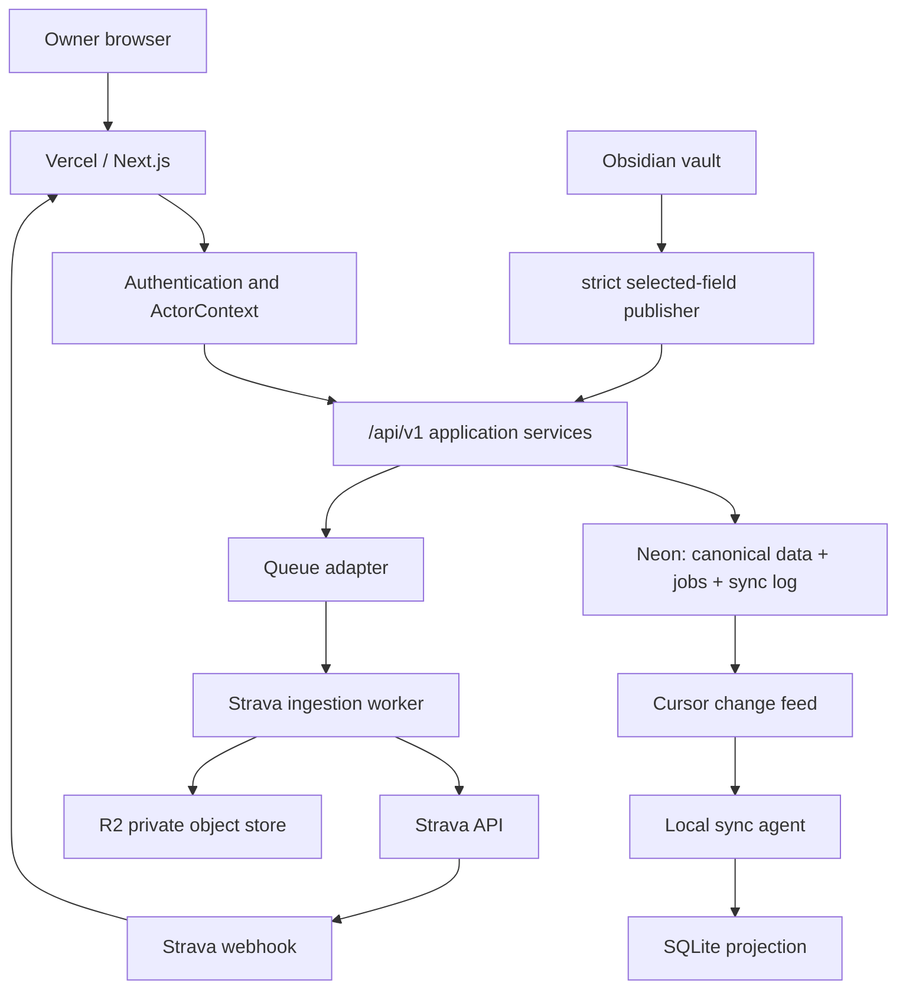
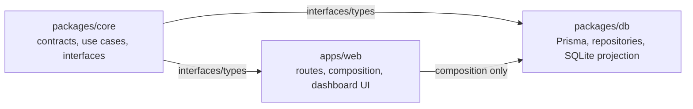
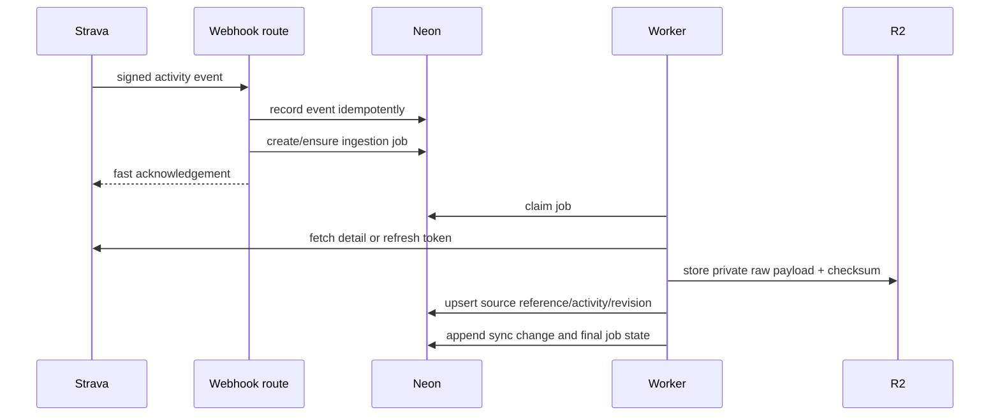

# Cloud Strava and Second Brain architecture

**Status:** Implementation-ready after Milestone 1 review  
**Scope:** Strava-only, single-athlete experience, cloud-authoritative workouts/plans, selected structured Second Brain fields only.

## Outcome and non-negotiable boundaries

RacePredictor is available online even when the local computer is off. Completed Strava activities arrive automatically, become canonical cloud activities, and can later be pulled to the local SQLite projection. Obsidian remains local; RacePredictor receives no vault copy.

| Authority | Owns | Does not own |
|---|---|---|
| Neon | Normalized activities, revisions, approved plans/calendars, connection/sync status, immutable selected-field snapshots | Raw provider bodies, Obsidian notes, secrets in plaintext |
| R2 | Private raw provider payload/file bytes | Query model, public browsing/listing |
| Local Obsidian | Qualitative source material and user-authored notes | Cloud workout authority, provider tokens |
| Local SQLite | Offline projection, sync cursor, controlled generated output | Independent cloud truth |

## Runtime topology



## Clean architecture responsibilities



- `packages/core`: Zod contracts, pure mapping/validation, and ports. It imports no Next.js, Prisma, S3, or filesystem module.
- `packages/db`: Prisma repositories for Neon and local SQLite sync projection. SQL/object-store/provider details do not escape this layer.
- `apps/web`: authenticates, builds `ActorContext`, composes adapters, exposes `/api/v1`, and renders prepared view models. Client components never receive tokens or raw payloads.

## Contracts and seams

| Port/contract | Minimum responsibility | First implementation |
|---|---|---|
| `ActorContext` | authenticated user, permitted athlete IDs, request correlation | fail-closed server auth adapter; explicit synthetic test actor |
| `ProviderAdapter` | authorize, exchange/refresh tokens, verify webhook, fetch/reconcile activities | Strava adapter |
| `ActivityRepository` | athlete-scoped canonical activity/revision/source access | Prisma/Neon |
| `RawObjectStore` | private put/head/presigned-get by object key | R2 S3-compatible adapter |
| `JobQueue` | enqueue/claim/retry/terminal status | Neon durable jobs, with queue adapter seam |
| `SyncRepository` | append/list acknowledged cursor changes | Prisma/Neon |
| `SecondBrainSnapshotRepository` | validate/idempotently store immutable snapshot | Prisma/Neon |
| `LocalProjectionRepository` | transactional apply and local cursor | SQLite |

All public request/response schemas are defined in `packages/core/src/contracts` and exported through its contract index. Existing `/api/v1` contracts evolve additively.

## `second-brain-context.v1`

The snapshot envelope is strict (`.strict()`):

```text
schemaVersion, athleteId, revision, publishedAt, contentHash,
selectedFields, context: {
  availability?, trainingPreferences?, constraints?,
  wellbeingCheckIns?, activityReflections?
}
```

The exact version 1 allow-list is:

| Section | Allowed fields | Limits |
|---|---|---|
| `availability` | `weeklyMinutesBudget`, `availableWeekdays`, `preferredLongRunDay`, `unavailableDateRanges[{startDate,endDate}]` | Valid weekday enums; at most 16 date ranges |
| `trainingPreferences` | `maxSessionsPerWeek`, `maxSessionMinutes`, `preferredSurfaces`, `avoidBackToBackHardDays` | Bounded numbers; surfaces are `road`, `trail`, `track`, or `treadmill` |
| `constraints` | `[{startDate,endDate,category,impact}]` | At most 20; category is `schedule`, `travel`, `equipment`, or `health`; impact is `no_training`, `reduced_training`, or `modified_training` |
| `wellbeingCheckIns` | `[{recordedOn,energy,fatigue,soreness,sleepQuality,stress}]` | At most 14; energy/fatigue/sleep/stress are 1–5 and soreness is 0–10 |
| `activityReflections` | `[{activityId,perceivedEffort,enjoyment,pain,outcome}]` | At most 50; effort 1–10, enjoyment 1–5, pain 0–10; outcome is `easier_than_expected`, `as_expected`, `harder_than_expected`, or `not_completed` |

All nested objects are strict. Version 1 deliberately has no free-text value, goal, prescription, event name, note identity, or source path. `selectedFields` contains a unique subset of those five section names and must exactly match the sections present in `context`. The encoded request is limited to 64 KiB.

The Zod contract is declared once and re-used by the local publisher and cloud route. It rejects unknown keys, unknown schema versions, duplicate content/revision mismatches, stale revisions, oversize payloads, and prohibited data. `contentHash` is SHA-256 over canonical JSON containing `schemaVersion`, `athleteId`, `selectedFields`, and `context`; it excludes `revision` and `publishedAt`. Retrying the same revision and hash returns the existing immutable snapshot. Changed content requires the next monotonic revision; re-publishing identical content as a new revision is rejected as a duplicate.

## Data model outline

Existing `Activity`, `ActivitySplitKm`, `WeeklyFeature`, and coaching data remain canonical concepts. Add:

| Model | Key constraints/purpose |
|---|---|
| `User`, `Athlete`, `AthleteAccess` | one-owner seed path now; roles/access relation for future athletes |
| `ProviderConnection` | `athleteId + provider`, encrypted refresh-token envelope, lifecycle/revocation state |
| `ProviderWebhookEvent` | provider event ID/subscription ID, receipt state, idempotency |
| `IngestionJob` | athlete/event/source reference, state, attempt count, next attempt, safe diagnostic code |
| `RawObject` | athlete/provider/key/checksum/content type/size/capture time; no body in Neon |
| `ActivitySourceReference` | `athleteId + provider + providerActivityId`, canonical activity relation |
| `ActivityRevision` | traceable update/delete/tombstone sequence |
| `SyncChange` | monotonic cursor/sequence, athlete scope, entity/version/tombstone |
| `PairedDevice` | hashed/revocable local-device credential and cursor state |
| `SecondBrainSnapshot` | athlete/revision/hash/schema/published time/allowed payload only |

Every owned repository method receives an athlete scope. A direct-object lookup or signed URL is authorized against the actor before access. The single-athlete UI does not reveal these future multi-athlete concepts.

## Strava ingestion flow



Webhook handling does not perform full ingestion in the request. Jobs are idempotent. Errors are classified as retryable or terminal. A bounded daily reconciliation detects missed events. Deauthorization/disconnect stops future ingestion but preserves already canonical activities unless the user later requests deletion.

## Local sync and conflict rules

1. Local agent authenticates as a paired device for one authorized athlete.
2. It requests changes after its stored cursor and applies a batch transactionally to SQLite.
3. It advances its cursor only after a successful local commit; replay is safe.
4. It writes only generated, owned file spans atomically and preserves user-authored text outside them.
5. It validates and publishes the selected-field snapshot. Cloud validation repeats every local check.

Cloud changes are authoritative for workouts/plans/calendars. Local Obsidian source material is authoritative only until published as a newer immutable selected-field snapshot. A snapshot cannot conflict with or mutate approved plans.

## Security and operational behaviour

- All cloud routes require authentication/authorization except narrowly scoped health and webhook verification endpoints. Production configuration fails closed until M8 identity secrets exist.
- OAuth state is single-use/expiring. Provider/device tokens are encrypted or securely hashed, never logged or returned to clients.
- R2 is private; no anonymous listing/read. Presigned reads are short-lived, athlete-authorized, and only created when needed.
- Workout freshness, ingestion health, Second Brain snapshot freshness, and local-device sync freshness are distinct UI states. A local outage does not make cloud workouts stale.
- Free-tier operation accepts cold starts and delay. Durable jobs plus reconciliation prioritize recovery. Feature flags disable provider processing safely; forward database repair/backup is preferred to destructive rollback.

## Endpoint outline

| Area | Additive endpoint family |
|---|---|
| Health/session | `GET /api/v1/health`, session/actor status |
| Provider lifecycle | `/api/v1/providers/strava/connect`, `callback`, `status`, `disconnect` |
| Webhooks/jobs | `/api/v1/webhooks/strava`, protected internal job/reconciliation triggers |
| Cloud reads | existing overview/activities/coaching endpoints backed by cloud services |
| Sync | `/api/v1/sync/status`, `changes`, `devices/register`, `devices/revoke` |
| Second Brain | `/api/v1/second-brain-context/snapshots`, `latest` |

## Milestone delivery and gates

| Milestone | Implementation result | Gate |
|---|---|---|
| M1 | decisions, architecture, backlog, test strategy | PO confirms scope/boundaries |
| M2 | contracts, schema, auth/storage/queue seams | tenant and contract tests pass |
| M3 | Strava OAuth/webhook/jobs/reconciliation | idempotency/failure tests pass |
| M4 | cloud dashboard/activities and honest status UI | component/API/critical browser tests pass |
| M5 | selected-field publisher and cursor sync agent | allow-list/replay/offline tests pass |
| M6 | integrated security, migration, regression, Playwright hardening | complete automated evidence |
| M7 | requirement-by-requirement PO acceptance | signed PASS record |
| M8 | Vercel/Neon/R2/Strava setup and live smoke | owner authentication required |

At each milestone update `docs/plans/CLOUD_STRAVA_SYNC_MILESTONES.md` with scope, QA results, product-test evidence, risks, and the Product Owner gate. M8 is the only point that requires owner credentials or external platform login.
