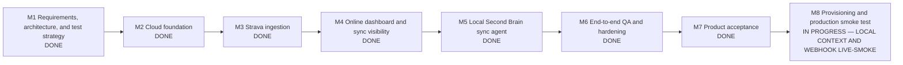

# Cloud Strava and Second Brain Sync — Milestone Plan

**Status:** In progress
**Owner:** RacePredictor delivery team
**Last updated:** 2026-08-12
**Scope:** A free-tier, always-available RacePredictor that imports completed Strava activities and receives only an explicitly selected, versioned set of structured fields from the local Obsidian Second Brain.

## Delivery map

## Fixed product boundaries

- Strava is the first and only provider implemented in this phase; Garmin remains a future adapter.
- The system is designed for multiple athletes, but this phase exposes a single-athlete product experience.
- Structured activity and training data is authoritative in the cloud database.
- Raw provider payloads and files are retained in private cloud object storage.
- The Obsidian Second Brain remains local and authoritative for selected qualitative context only.
- RacePredictor never receives vault files, arbitrary Markdown, backlinks, unrelated note metadata, or filesystem paths.
- The local publisher sends only fields permitted by the versioned `second-brain-context.v1` contract.
- Cloud infrastructure must remain within free-tier constraints for the initial single-athlete workload.

## Milestone gates

| Milestone | Outcome | Automated evidence | Product evidence | Status |
|---|---|---|---|---|
| M1 | Requirements, architecture, data boundaries, risks, and test strategy are approved. | Baseline core 15/15, web 22/22, local pipeline 3/3, local coaching 6/6, typecheck and diff checks pass. | Product Owner accepted UR-01–UR-16 and all six M1 gates; no M1 blockers. | Done |
| M2 | Tenant-safe cloud domain, persistence, storage, identity, and sync seams exist. | Core 24/24, database 11/11, web 38/38, Prisma, production build, and security route audit pass. | Independent QA and Product Owner accepted the fail-closed cloud foundation and unchanged local experience. | Done |
| M3 | Strava OAuth and webhook ingestion are idempotent, durable, and recoverable. | Core 56/56, DB 33/33, web 54/54, Prisma, production build, local 18/18, and browser 11/11 pass. | Synthetic connect/backfill/webhook/update/delete/deauthorization produces one traceable canonical activity; formal QA and Product Owner pass. | Done |
| M4 | The online dashboard reads cloud data and clearly shows connection and freshness state. | Core 65/65, DB 39/39, web 59/59, local 18/18, browser 14/14, Prisma, build, and privacy/security gates pass. | Product Owner accepted online/offline freshness, cloud Plan/Calendar/Today, read-only plan safety, and recoverable states. | Done |
| M5 | A local agent publishes and downloads safe structured snapshots without exposing the vault. | Core 71/71, DB 44/44, web 64/64, local 24/24, browser 15/15, Prisma, build, DPAPI, scheduler, privacy, and security gates pass. | Product Owner accepted pair/re-pair/revoke, replay/offline recovery, Obsidian byte preservation, approved-plan sync, and selected-context privacy. | Done |
| M6 | The complete path is regression-tested, secure, observable, and operable. | Core 77/77, DB 47/47, web 68/68, local 24/24, browser 15/15, Prisma, build, audit, recovery, privacy, and diff gates pass. | Product Owner accepted Strava controls, full synthetic online/local/offline journey, shadow blocks, rollback, and free-tier guardrails. | Done |
| M7 | Product Owner signs off against every in-scope requirement. | All 16 original requirements and 21 final checklist items have objective evidence or an exact M8 verification step. | Product Owner accepted the credential-free candidate for production verification; five production dependencies are explicitly owned. | Done |
| M8 | Free-tier services are provisioned, secrets configured, and production is smoke-tested. | Core 82/82, database 54/54, web 77/77, typecheck, production build, focused manual-backfill and route-security coverage, Prisma, audit, and diff gates pass. History imports now reserve provider capacity before I/O and retain durable checkpoints on a pause or retry. | Owner login, Neon migration, private R2 write path, real Strava OAuth, and bounded real-history import are live. The imported workout is visible online and the durable job completed once. Live automatic-webhook and local selected-context evidence remain. | In progress — deploy pacing, then final live journeys |

## Feedback cadence

At the end of every milestone:

1. Update this plan's diagram and status table.
2. Report implemented scope, automated QA results, product-test results, and open risks.
3. Record Product Owner gate status.
4. Start the next milestone only when the current exit gate is satisfied.

## Delivery state legend

- `DONE` — exit gate passed and evidence recorded.
- `IN REVIEW` — implementation or planning is complete and its gate is being checked.
- `IN PROGRESS` — active implementation and continuous testing.
- `PLANNED` — accepted scope, not started.
- `AUTHENTICATION REQUIRED` — implementation can proceed no further without the owner's platform or provider sign-in.
- `OWNER HANDOFF` — Codex completed the safe automated portion; a provider secret, consent screen, or account checkout must be handled directly by the owner.
