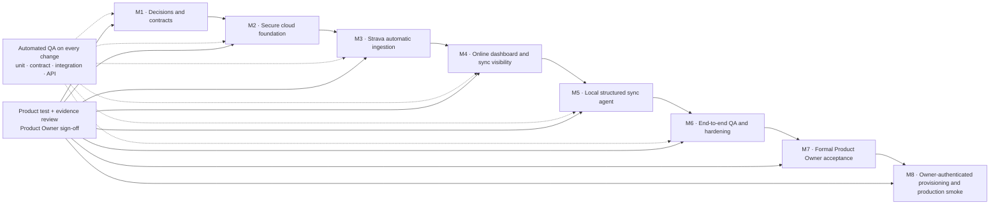

# Cloud Strava Sync Test Strategy

## Purpose and quality position

This strategy defines the evidence required to introduce the online RacePredictor safely. The target product is an online dashboard with Strava-first automatic ingestion, cloud-canonical workout data, cloud object storage for raw provider payloads, and a local SQLite/Obsidian agent that publishes only selected, structured Second Brain context. It does not authorize uploading the whole Obsidian vault, implementing multi-athlete UI, Garmin-specific integrations, or automatically activating a coaching plan.

Quality is continuous: each story must have automated acceptance tests before it can be integrated, each milestone has an end-to-end product check, and no milestone is complete until a Product Owner records an evidence-based sign-off. A demonstration alone is not sufficient evidence.

## Scope and testable invariants

| Area | Required invariant | Test consequence |
|---|---|---|
| Provider ingestion | A valid Strava event produces one canonical activity, even when delivered repeatedly or out of order. | Test subscription validation, documented signature verification when configured, durable recording before acknowledgement, retry, replay, update, and delete behavior. |
| Cloud authority | The cloud remains the canonical source for structured workouts and plans while the local computer is offline. | Test dashboard reads when the local agent is stopped and reconciliation after it returns. |
| Raw retention | Raw provider data remains private, checksum-addressed, athlete-scoped, and retrievable only through short-lived authorised access. | Test object naming, checksum verification, access denial, expiry, and no raw payload leakage in APIs/logs. |
| Local synchronisation | Cloud-to-local changes are cursor-based, transactional, replay-safe, and do not overwrite user-authored Obsidian content. | Test interrupted sync, duplicate batches, stale cursors, conflict handling, and generated-section preservation. |
| Second Brain publication | Only selected `second-brain-context.v1` fields reach the cloud as immutable snapshots. | Test allowlist/rejection, schema/version/hash validation, idempotent revisions, and snapshot freshness. |
| Tenant safety | Every stored, queued, retrieved, and signed resource is scoped to an athlete, although only one athlete is exposed in this phase. | Test cross-athlete denial at API, repository, queue, object-store, and sync-token boundaries. |
| Coaching safety | Uploaded context or an activity event never activates, edits, or adapts a plan. | Test authorization and state-transition negative paths. |

## Delivery map and quality gates

| Milestone | Product slice | Automated quality work planned before implementation | Exit evidence |
|---|---|---|---|
| M1 | Architecture, privacy boundary, versioned contracts, milestones, backlog, and test strategy | Contract/document consistency design and baseline regression evidence | Scope and contracts are unambiguous; Product Owner accepts the measurable scope and exclusions. |
| M2 | Auth and athlete-scoped cloud schema, migrations, repositories, encryption, raw-object boundary, sync log, test harness, and synthetic fixtures | Contract schemas, fixture purity, migration lifecycle, repository isolation, encryption adapter, idempotency, and R2 adapter tests | Clean migration and recovery evidence; no anonymous or cross-athlete access; PO accepts persisted lifecycle behavior. |
| M3 | Strava OAuth, webhook receipt, durable worker, raw retention, normalization, dedupe, bounded backfill, and reconciliation | OAuth state tests, callback verification, documented signature tests when configured, provider fixtures, queue/retry/replay, checksum, and database integration tests | A synthetic lifecycle reaches canonical history exactly once; missed events recover; PO accepts connection and ingestion behavior. |
| M4 | Authenticated cloud dashboard, change feed, and separately truthful operational/freshness status | Route/API tests, browser journeys, page state/error/stale tests, accessibility smoke tests | Dashboard works with local agent stopped and distinguishes workout from Second Brain freshness; PO accepts the core online journey. |
| M5 | Paired local agent, SQLite projection, controlled Obsidian updates, and selected context publication | Cursor/replay, offline, partial-failure, generated-marker, snapshot allowlist, and device-token tests | Offline recovery is lossless and user-authored Markdown remains intact; PO accepts context-sharing boundaries. |
| M6 | Reconciliation, shadow comparison, security, free-tier guardrails, full regression, and release hardening | Cross-format dedupe, redaction, permissions, expiry, restore, rate-limit, full build, and Playwright tests | Credential-free release-candidate evidence is green with no unresolved release blockers; PO accepts the evidence pack. |
| M7 | Formal Product Owner requirements review | Independent evidence traceability audit | Every non-production requirement passes or is explicitly blocked; PO records the release-candidate decision. |
| M8 | External service provisioning, deployment, and bounded production smoke | Production migration, live-service smoke, access denial, rollback/feature-disable check | Production-only evidence passes and the Product Owner records final sign-off. |

## Milestone 1 plan

### Objectives

M1 defines the deterministic, privacy-safe evidence and contracts that later code will implement before external credentials or infrastructure are needed: provider adapter, durable event repository, raw-object store, cloud canonical repository, cursor-based sync, local projection, selected-context publisher, authentication/authorization policy, and dashboard data source.

### M1 test deliverables

1. A specified synthetic data factory shared by core, database, API, worker, sync, and Playwright tests, implemented in M2.
2. A versioned fixture catalogue for Strava webhook events and activity detail/stream responses, implemented in M2 and M3.
3. A `second-brain-context.v1` fixture catalogue proving allowed fields and rejection/redaction behavior, implemented in M2 and M5.
4. A contract-test matrix for request, response, error-envelope, cursor, idempotency-key, and freshness-status behavior.
5. A mandatory two-athlete/two-actor isolation pattern for all cloud tests; no test may depend on an implicit global athlete.
6. An isolated test-environment design for PostgreSQL, object storage, queue, temporary SQLite, and temporary Obsidian vault, implemented from M2 onward.
7. A documented CI matrix and evidence template used by every later milestone.

### M1 automated acceptance checks

| Check | Expected result |
|---|---|
| Fixture design | The catalogue uses synthetic names/IDs/content only and prohibits vault paths, tokens, personal activities, and real account IDs. |
| Contract evolution | The contract rules define where additive fields are accepted and where unsupported versions or ambiguous states reject. |
| Tenant propagation | Every proposed repository/API/queue/object/sync contract requires `athleteId`; no design depends on a global athlete. |
| Context allowlist | The v1 allowlist and prohibited-data rules are explicit, including field-level redacted errors. |
| Safety transitions | Context publication, webhook receipt, and worker normalization contracts have no operation that can activate or mutate an approved plan. |
| Test isolation | The M2 implementation plan requires unique temporary roots and cleanup for every parallel test run. |

### M1 Product Owner review

The Product Owner reviews the approved scope against the M1 testable invariants, fixture examples, and contract matrix. Sign-off means the product boundaries are understood; it does **not** approve deployment or a live provider connection. Missing sign-off is a milestone `FAIL`, not an implementation detail to defer.

## Test pyramid

The existing repository has Node test suites for `packages/core`, `packages/db`, and `apps/web`, plus a Chromium Playwright suite. The cloud work extends that structure rather than replacing it.

| Layer | Purpose | Examples | Run cadence |
|---|---|---|---|
| Unit | Pure domain, validation, mapping, crypto-envelope, and cursor behavior | Strava mapper, context allowlist, webhook timestamp window, idempotency key, hash, timezone, freshness derivation | Every change |
| Contract | Shared schemas and provider boundary compatibility | `/api/v1` envelopes, `second-brain-context.v1`, webhook payload parser, Strava adapter response fixtures | Every change; provider fixture refresh before releases |
| Integration | Database, migrations, queue, object-store, repositories, local SQLite and agent | transaction rollback, dedupe, R2 checksum, cursor replay, generated-marker preservation | Every pull request and milestone gate |
| API | Authentication, authorization, request validation, state transitions | webhook validation/signature handling where supported, device sync cursor, context publish, object download, connection revocation | Every pull request and milestone gate |
| Browser | High-value user workflows and truthful UX state | connect status, online dashboard, ingestion warning, fresh/stale Second Brain marker, disconnect | Every pull request affecting UI; full suite at milestone gate |
| Production smoke | Deployed, non-destructive proof | authenticated dashboard health, webhook endpoint validation, read-only canonical activity, object-store access denial | Preview and release candidate |

Browser tests must remain focused: most errors belong in lower layers. They use role/label locators and deterministic API fixtures, avoid fixed waits, and preserve trace/screenshot artifacts on failure. Existing Playwright configuration already provides isolated paths under `.local/e2e`; cloud-specific tests must add isolated environment values rather than reuse a developer's local database or vault.

## Synthetic provider fixtures and test doubles

### Fixture catalogue

| Fixture family | Required cases |
|---|---|
| Webhook event | subscription validation; valid create/update/delete; duplicate delivery; same event ID with altered payload; bad signature; stale timestamp; unknown connection; deauthorisation; unrecognised object type. |
| Strava activity | minimum valid run; optional metrics absent; laps present/absent; timezone boundary; private activity; corrected activity; deleted activity; unsupported sport; malformed numeric values. |
| Streams/raw payload | valid compressed raw body; checksum mismatch; storage write timeout; object already present; corrupted download; payload too large. |
| Provider responses | 200, 401 refreshable, revoked token, 403 scope failure, 404 deleted activity, 429 with retry timing, 5xx transient failure, malformed JSON. |
| Context snapshot | minimum allowed snapshot; selected availability/preferences/constraints/check-ins/reflections; duplicate hash; newer revision; old cursor; unknown fields; local path; credential-shaped value; unsupported version; payload size over limit. |
| Sync batches | empty batch; ordered changes; duplicate changes; out-of-order changes; a deletion; failed local transaction; interrupted generated-note write; expired device token. |

Fixtures must preserve the provider's public shape where needed but be hand-authored/minimised. A recorded response may be added only after all identifiers, locations, timestamps, tokens, route geometry, and private notes have been removed and a fixture-purity test passes. Fixture refreshes are reviewed as contract changes.

### Required doubles

- A deterministic clock, UUID/event-ID source, and retry scheduler.
- A fake Strava client that validates requested endpoint/parameters and records token refresh/retry calls.
- An in-memory queue with explicit acknowledge, retry, delay, poison-message, and replay controls; an integration configuration using the chosen queue's development emulator or isolated test queue.
- An object-store fake for unit tests and an S3-compatible local emulator or isolated test bucket for integration tests. It must expose object metadata, checksum, expiration, and prefix access checks.
- A temporary PostgreSQL database per integration run, a temporary SQLite mirror, and a temporary Obsidian vault. No shared development database is valid test infrastructure.

## Automated test design by concern

### Domain, contract, and API tests

| Concern | Required assertions |
|---|---|
| Authentication and authorization | Unauthenticated requests return the standard unauthenticated error; valid actor/device access is limited to its athlete; revoked sessions/tokens fail; OAuth callback state is single-use and expires. |
| Webhook receipt | Signature and verification token are checked before processing; event is persisted before a 2xx acknowledgement; duplicate delivery is accepted safely; failures return no confusing successful ingestion claim. |
| Provider credentials | Refresh tokens are never returned by APIs, logs, errors, raw fixtures, or context snapshots; ciphertext cannot be used without the configured key; disconnect/deauthorisation prevents future fetches. |
| API compatibility | Runtime validators cover success, validation, not-found, conflict, rate-limited, unavailable, and forbidden envelopes; additive fields do not break supported clients. |
| Idempotency | Same webhook/provider activity/import/snapshot/approval request gives one logical outcome; mismatched use of an existing idempotency key is rejected. |
| Freshness | Separate timestamps/states exist for workout ingestion, dashboard data, last successful local sync, and last structured-context snapshot. A local agent outage cannot mark cloud workouts stale. |
| Plan safety | Webhook, sync, and context routes cannot create/activate/edit a plan. Existing explicit approval concurrency guards remain covered by regression tests. |

### Database and migration tests

1. Apply all migrations to a new PostgreSQL database, generate the ORM client, and run the complete integration suite.
2. Upgrade a populated Phase 1-shaped database fixture, preserving all existing activities, coaching records, immutable plans, calendar audit events, and IDs/references needed by existing APIs.
3. Verify every new row has an athlete scope and every uniqueness/index rule includes the appropriate scope: provider connection, provider source reference, webhook event, raw object, ingestion job, sync change, paired device, and context snapshot.
4. Prove transactional behavior: failed normalization, object metadata persistence, plan-state guard, or sync apply rolls back its own durable state without corrupting unrelated records.
5. Exercise forward migration recovery. Production migrations are not assumed reversible: the release procedure must prove backup/restore or a compatible forward repair, not a destructive automatic rollback.
6. Run query-plan/bounded-query checks for dashboard timeline, cursor changes, provider dedupe lookup, and snapshot-status lookup using representative synthetic volume.
7. Run existing database gate checks alongside new cloud checks so canonical activity, split, weekly aggregation, and coaching invariants do not regress.

### Worker, queue, raw storage, and reconciliation tests

- A create event writes a durable receipt, schedules exactly one job, fetches details, writes a private raw object, normalizes one canonical activity, recomputes affected analytics, and appends one sync change.
- A duplicate event, worker retry, or job replay produces no duplicate activity, raw object, analytics row, or sync change.
- Update and delete events produce a traceable activity revision/tombstone and correctly update dashboard/local projections.
- Token refresh, rate limit, 5xx, object-store fault, malformed payload, and database fault produce classified retry or terminal-failure states. Retry budget exhaustion is visible to the dashboard/operations surface.
- The reconciler compares a bounded Strava window/cursor with stored source references, recovers a deliberately omitted event, and does not overwrite newer canonical revisions.
- Raw object metadata checksum equals the persisted object; an existing content-addressed object is reused safely; signed download can access only the intended athlete/object and expires.

### Local sync and Obsidian failure/replay tests

| Scenario | Expected outcome |
|---|---|
| Local agent offline for several days | Cloud data continues; first reconnect downloads all cursor changes without an arbitrary time-window loss. |
| Network failure before local commit | Cursor is not advanced; retry applies the same change once. |
| Process stops after SQLite commit before acknowledgement | Replayed change is idempotent and ends with one local projection. |
| Invalid/partial batch | Entire batch or defined atomic unit rolls back; cursor does not skip the rejected change; actionable redacted error is recorded. |
| Cloud change deletion | SQLite projection and controlled generated material reflect removal/tombstone without deleting user-authored notes. |
| User edits Markdown outside generated markers | Sync preserves it byte-for-byte; only the owned generated span may change. |
| Generated write interrupted | Previous valid file remains; no half-written context is published. |
| Context upload retry | Same content hash/revision returns the existing immutable snapshot; changed allowed content creates the next revision. |
| Context contains unapproved data | Client blocks before upload and cloud revalidates; no snapshot is activated. |
| Device revoked/athlete changed | Further pulls/pushes fail without exposing data; re-pairing requires explicit authenticated registration. |

## Playwright critical journeys

Each journey uses synthetic seeded cloud data and mocked provider endpoints unless it is explicitly labelled as a preview/release smoke test. No Playwright journey requires a real Strava account.

| Journey | Assertions |
|---|---|
| Owner signs in and connects Strava | Clear consent/connection status; callback failure and cancellation are recoverable; token values never appear in page/source/accessibility tree. |
| Online dashboard while local agent is off | Recent cloud activity and prediction render; local-sync status explains that the local computer is offline without classifying cloud workouts as missing. |
| New activity operational visibility | Fixture-driven completed, retrying, and failed ingestion states have distinct actionable copy; refresh does not duplicate activity rows. |
| Workout freshness versus context freshness | Dashboard shows two separate timestamps/states. An old Second Brain snapshot shows a warning but does not suppress fresh activities. |
| Selected context visibility | User can see snapshot version/time and allowed summary metadata; arbitrary note content, filesystem paths, and raw payloads are never displayed. |
| Existing coaching approval regression | Proposal remains draft until explicit confirmation; one active plan; existing calendar/Today flows retain Phase 1 behavior. |
| Disconnect/revocation | Provider status changes, future ingestion is disabled, historic canonical activities remain visible, and local context remains unaffected. |
| Tenant isolation (test-only two-athlete setup) | A signed-in actor cannot navigate directly to, infer counts for, download raw data for, or sync another athlete's records. |
| Responsive/accessibility smoke | Key status, error recovery, and disconnect controls are keyboard-operable and work at the current desktop plus responsive baseline. |

Run the narrow spec first during implementation. At milestone completion run the full Chromium suite. Failure artifacts (trace, screenshot, video when configured, browser console, network assertions) are linked in the milestone evidence record.

## CI, regression, and release commands

The current baseline commands include `npm run lint`, `npm run build`, workspace Node test scripts, database gate scripts, and `npm run test:e2e --workspace @racepredictor/web`. M1 must formalise a single non-interactive command for the cloud test matrix rather than relying on manually assembled developer commands.

| Gate | Minimum commands/evidence after implementation |
|---|---|
| Static | `npm run lint`, package type checks, and a clean contract-generation check. |
| Unit/contract | `npm test --workspace @racepredictor/core`, `npm test --workspace @racepredictor/web`, plus the cloud contract suite. |
| Database | `npm run db:generate`, clean migrate deploy, upgrade fixture migration, `npm run db:test:gate`, and cloud repository/migration integration suite. |
| Local integration | Existing local-import/analytics/coaching/Obsidian tests plus the cloud-to-local sync/replay suite using temporary roots. |
| API/worker | Auth, webhook, ingestion, raw-storage, reconciliation, and device-sync integration suites. |
| Browser | `npm run test:e2e --workspace @racepredictor/web`; the relevant changed journey runs first. |
| Deployment smoke | Preview: authenticated health/read-only dashboard and failure-path checks. Release candidate: environment-scoped migration, webhook validation, storage permission denial, and feature-flag disable/rollback exercise. |

CI must publish a concise machine-readable summary and retained failure artifacts. Credential-bearing checks run only in protected environment scope; pull requests use fakes/emulators and cannot access production infrastructure. A flaky test is a defect: quarantine requires an owner, issue, expiry date, and an equivalent non-flaky release gate. It cannot silently reduce release coverage.

## Milestone exit and Product Owner sign-off

### Mandatory PASS/FAIL evidence

| Evidence category | PASS requires | Automatic FAIL when |
|---|---|---|
| Requirements traceability | Every approved requirement and explicit exclusion maps to tests or a justified manual product check. | A requirement has no evidence, or a deferred feature is represented as delivered. |
| Automation | Required static, unit, contract, integration, API, database, sync, and changed-browser suites pass from clean test environments. | A required test fails, is skipped without accepted risk, or relies on personal/live data. |
| Data safety | Tenant isolation, encryption/redaction, object access, and context allowlist tests pass. | Any cross-athlete access, credential exposure, whole-vault transfer, or unauthorized object retrieval is found. |
| Reliability | Idempotency, replay, reconciliation, transaction, and failure recovery tests pass. | Retry/replay can duplicate/lossily apply data, or a failure leaves uncertain canonical state. |
| Product behavior | A Product Owner can reproduce critical outcomes from the documented test environment and confirms wording/statuses are truthful. | The UI claims fresh data, provider success, context freshness, or plan adaptation without proof. |
| Operations | Runbook, monitoring/error state, rollback/feature-flag evidence and migration recovery are complete for the milestone's deployed scope. | Production-affecting change lacks recovery evidence or an observable failure state. |

### Product Owner sign-off record

For every milestone, the release owner attaches the following record to the progress document/release item:

| Field | Required content |
|---|---|
| Milestone and build/commit | Exact milestone name, revision, environment, and test-data version. |
| Requirements reviewed | Link each requirement/exclusion to test IDs, screenshots/traces, API assertions, or a manual script. |
| Automated evidence | Commands, date/time, pass counts, links/paths to logs and browser artifacts. |
| Product test evidence | Preconditions, steps, observed result, screenshots where useful, and the PO's decision. |
| Defects and accepted risks | Severity, owner, mitigation, expiry/review date, and whether it blocks release. |
| Decision | `PASS` (approved to proceed), `FAIL` (rework required), or `NEEDS DECISION` (scope/authority unresolved). |
| Product Owner | Named approver and timestamp; absence of this row is `FAIL`. |

The Product Owner signs off against requirements—not against an implementation summary. Engineering may mark code complete only after the result is `PASS`; an environmental inability to run a required test is `NEEDS DECISION`, never assumed pass.

## Regression suite ownership

The release regression suite includes all existing Phase 1 tests plus new cloud tests. It protects the accepted local coaching behavior while cloud capabilities are added behind explicit configuration/feature controls.

- Core: activity/coaching contracts, plan lifecycle, timezones, reminder and context boundaries.
- Database: imports, dedupe, local analytics, canonical integrity gate, local coaching repository, and Obsidian publisher.
- Web/API: dashboard source behavior, import routes, coaching routes, calendar/TODAY lifecycle, and cloud APIs.
- Cloud: tenant isolation, migrations, credentials, webhooks, queue jobs, raw storage, reconciliation, sync cursor/replay, structured context snapshots.
- Browser: existing digital-coach suite plus online dashboard, status/freshness, provider lifecycle, and tenant boundary journeys.

Any defect fixed in cloud ingestion, sync, authorization, migration, data correctness, or user-visible status must add a focused regression test at the lowest effective layer before the fix is accepted.

## Risks requiring ongoing review

- Strava application approval, production credentials, Vercel/Neon/R2 provisioning, and real webhook registration require owner authentication. They are not test prerequisites for M1 but must be captured in protected-environment smoke evidence once available.
- Free-tier execution/storage limits can cause queue delay, cold starts, or retention pressure. Synthetic load and retention tests should set warning thresholds before real usage approaches a limit.
- Cloudflare R2 and any queue emulator can differ from managed behavior. Run provider-adapter contract/smoke tests in an isolated non-production cloud environment before M4/M8 sign-off.
- OAuth and webhook security controls depend on correct deployed URLs, secrets, and clock behaviour; local tests cannot prove production configuration.
- Existing repository tests target the local SQLite product. They remain mandatory regression coverage but do not prove the new cloud architecture until the new test matrix exists.
