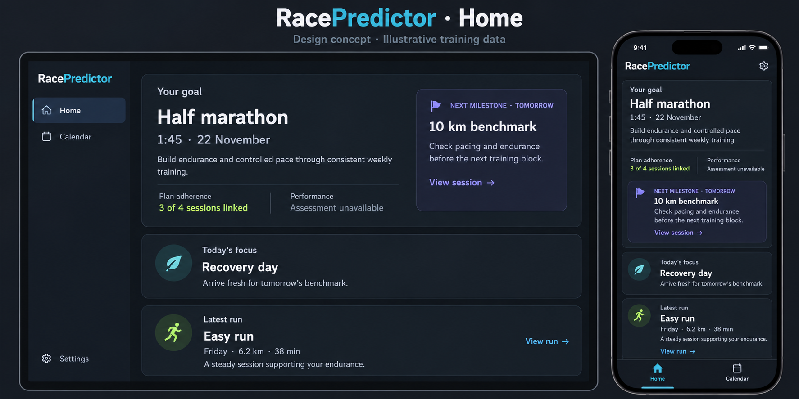
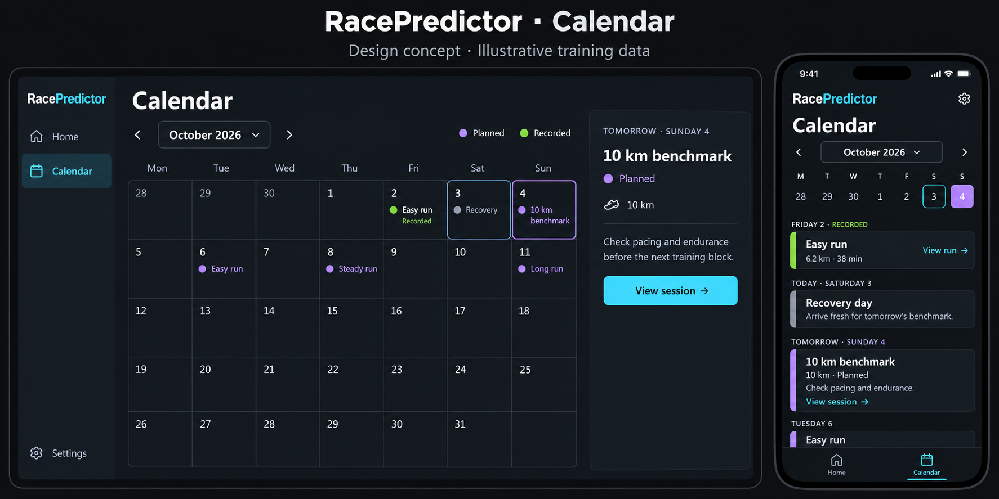

# Home and Calendar redesign: architecture and execution plan

Date: 3 October 2026 (Africa/Johannesburg). Status: planning deliverable; implementation has not started under this request.

> **Execution follow-up, 4 October 2026:** Subsequent owner delegation authorized P01–P06 and the first-release verification portion of P10. The historical planning scope below is retained; current implementation, measured layouts and validation are recorded in [the execution handoff](HOME_CALENDAR_REDESIGN_IMPLEMENTATION.md). P07–P09 remain gated; deployment remains separate.

> **Approved P06 amendment, 4 October 2026:** Compact Calendar now uses the Monday-first month grid and complete day dialog instead of week/date selection and agenda. Navigation shows the existing logo alone. P06 presentation requirements below reflect this amendment; the later implementation and QA evidence are in [the mobile month handoff](CALENDAR_MOBILE_MONTH_IMPLEMENTATION.md).

This chat ran in normal mode. The owner explicitly requested an architect plan before implementation. Runtime chat mode does not change that scope. This work creates this document and durable copies of the approved visual references only. Application code, schemas, data, existing design contracts, deployment and implementation workflows are outside this request.

## Problem Framing

RacePredictor is one athlete's personal training companion. Goal and training-plan conversations occur outside the app in ChatGPT/Codex. The app receives approved plans and preserves canonical recorded history, effective schedules and reasoned adjustment history. The owner wants a spacious, engaging daily experience with little text on phone and desktop.

The daily questions are: What is my main goal? Why does it matter? How does this plan support it? How am I doing in following the plan, separately from performance? What is the next milestone's target, purpose and intended outcome? What should I do today? What does my latest activity tell me?

### Confirmed constraints

- Exactly two primary destinations: **Home and Calendar**. Settings, plan management, activity history, imports, recovery and evidence remain secondary and accessible. Existing URLs and deep links stay valid.
- Home has three ordered groups in DOM and visual reading order: **Goal + milestone; Today's focus; Latest activity**. On desktop the milestone is an inset beside the goal inside group one, not a separate fourth panel. On phone it stacks inside that group.
- Adherence and performance have separate compact summaries, including separate unavailable states. Neither activity volume nor a date-based suggested match is an adherence score.
- Today presents the effective approved workout, prescribed rest, or explicitly unscheduled day, with supported purpose. Advice cannot change the prescription.
- Latest activity shows recorded facts and at most one short supported takeaway with direct access to complete detail. Do not substitute an older reviewed activity for the latest recorded one.
- Desktop Calendar provides a month overview and selected-day summary. Mobile/tablet below 1200px uses the same Monday-first month grid with compact distance/duration summaries and a full day dialog.
- **A day with planned sessions and recorded activities MUST show both. Each planned session and each activity MUST be independently openable. Recorded activity never replaces a planned session. Multiple records of either kind are supported. Same date does not prove a match or completion.**
- Preserve complete existing session and activity content, permitted actions, approved source, effective overlay and immutable adjustment history.
- Routine Home does not expose plan version numbers, AI processing stages, validation/publication machinery or infrastructure panels. Affected conclusions retain short material limitations; full evidence and diagnostics are secondary.
- Retain authentication, athlete scoping, privacy, saved IANA timezone, stable API contracts, approved-plan authority and local/online behavior.

### Approved visual references

The copies below were inspected and copied unchanged from the owner's approved generated images. They are documentation references, not public application assets or factual training records.

Use dark charcoal/slate surfaces, white/off-white type, cyan navigation/actions, violet planned sessions/milestones and lime recorded activities, with restrained borders and radii. Preserve the actual existing logo and sans-serif identity. The reference's device frames, oversized promotional heading, exact geometry and fictional copy are not implementation requirements. In particular, its sample half marathon, target time, benchmark, linked-session count, recovery story and latest-run conclusion must never seed real data.

The Calendar illustration does not demonstrate every same-day case. The explicit both-records requirement above takes precedence over that omission. “Tomorrow” is computed at render time from the saved timezone; the conversation's tomorrow is not a stored milestone date.

### Assumptions and open decisions

- Repository source describes available capabilities; this inspection did not query the owner's private database or live authenticated deployment. Actual approved goals, milestone values and evidence completeness remain unverified. This plan collects no new goal facts.
- This is a read/presentation redesign first. A release with truthful unavailable assessments is possible, but does not mean the missing analytical capability is delivered.
- Recommended defaults: retain Monday–Sunday weeks; use the existing 767px compact-navigation breakpoint initially; introduce a desktop Calendar side pane only when the grid and pane fit readably (initial target 1100px). At widths below 1200px, the month grid shows compact distance/duration summaries and opens full day dialogs. Validate reflow and complete detail at 320/390/768/1024px and 200% zoom.
- Recommended latest selector: latest recorded activity across existing supported sports, matching the current Home contract. Label it “Latest activity”; show run-specific facts when it is a run. If the owner later wants a run-only selector, make that an explicit product amendment, not a silent filter.
- Recommended adherence period for a future assessment: elapsed portion of the current Monday–Sunday week in the plan timezone, explicitly labeled with dates. The final artifact must declare its policy and denominator; do not derive the reference's “3 of 4” count.
- Open capability decisions: approve an externally authored Home narrative/assessment artifact contract described below; supply an approved milestone purpose/outcome; decide whether to support non-race benchmarks. Existing race-milestone contracts do not establish generic benchmark semantics.
- No answer to these capability decisions blocks the presentation stories. Their dependent capability stories remain gated and display precise unavailable states meanwhile.

## Requirements Check

### Authority conflict to amend during execution

[DESIGN_INTENT_CONTRACT.md](../design/DESIGN_INTENT_CONTRACT.md), version 1.1, explicitly allows later user decisions to override it. Its N1/N2 navigation table and [HOME_GOAL_FIRST_DESIGN_CHANGE.md](../design/HOME_GOAL_FIRST_DESIGN_CHANGE.md) still specify Home/Training/Plan. The owner now explicitly chose Home/Calendar. The newer decision governs this plan. **Do not edit those existing documents in this planning task.** Story P01 records the amendment before future application implementation, including revised Calendar layout and routine-Home processing visibility rules. Domain/evidence/accessibility rules remain binding.

### Capability evidence and gaps

| Requested content | Verified source/boundary | Available now / required fallback |
|---|---|---|
| Main approved goal, date/distance/time or consistency target | `goalContextRouteDataSchema`; `GET /api/v1/coaching/goal-context/active`; immutable goal-context sidecar | Available when ready; `goal.why` exists but current Home does not present it. No target time may be approved. Do not invent one. |
| Why the goal matters | Settled goal `why`, included in goal-context read | Existing text may be long (up to 2000 characters). Show intact short text; long text needs detail or a source-bound approved summary, not word clipping. |
| How the plan supports the goal | Approved active plan's `rationale`, weekly routine and sessions | Plan rationale exists but is absent from goal-context response. Reuse active-plan read with identity checking. It may be long or not a concise personal explanation. |
| Next milestone target | V2 `raceMilestoneSchema`: ID, title, distance, target date/time, optional event | Ready sidecar carries up to 12 race milestones. Next is the earliest on/after local today. No future milestone and no milestone are distinct states. |
| Milestone purpose, intended outcome, direct session link | Not fields in `raceMilestoneSchema` | Missing. A date/title similarity is not a relationship. Show target and precise missing-purpose state; link to Plan source until an explicit session reference exists. |
| Adherence | Effective sessions, explicit skips, activities; review comparison enums | No authoritative adherence assessment/confirmed completion ledger found in inspected boundaries. `chooseSuggestedSession` yields suggested/ambiguous/none by date, not confirmed completion. Show “Adherence not assessed — session links are unconfirmed.” |
| Performance toward race goal | Current-fitness prediction, observed features, persisted activity reviews | No compatible race-date progress assessment found. Existing Home explicitly says race-day progress cannot yet be assessed. Current fitness and elapsed-time/distance deltas do not establish race readiness. |
| Today's purpose and next workout | Today API effective `session.purpose`, prescription, `todayScheduleKind`, `nextWorkout` | Existing optional classification supports prescribed rest versus unscheduled. Old/incomplete responses need schedule-unavailable state. A generated/fallback daily message is not an approved purpose. |
| Latest recorded activity and takeaway | Activity list and persisted `/coach-review`; full detail uses existing feedback components | Facts available separately from review. Reviews allow long assessment and limitations. No guaranteed safe one-sentence summary exists. Use short complete assessment only when safe; otherwise concise neutral unavailable-summary state plus full detail. |
| Planned plus recorded Calendar | Calendar API `sessions[]`, `activities[]`, `activitiesReadStatus`, `timezone`; day dialog maps all records | Existing behavior must be preserved. Current compact cell shows first of each; its `total - 2` overflow calculation can undercount when only one category is populated. New projection counts hidden items from actual visible counts. |

Race milestones currently require target time and performance-goal compatibility. The image's “10 km benchmark” cannot be assumed to be such a milestone, or synthesized from a planned run. Generic milestones require a separately approved domain extension, not only a new label.

## Architecture Overview

### Current system and runtime

- `apps/web/app/dashboard/page.tsx` chooses `OnlineDashboardShell` through `shouldRenderOnlineUi`; otherwise it composes local analytics, or explicit mock analytics. Online UI selection is cloud enabled, or nonproduction `online-fixture`. Mock analytics is not a general license to substitute fictional coaching records.
- `DashboardShell` already orders `HomeGoalContext`, compact `TodayCoachingCard`, then `HomeRecentTraining`. Readiness is a secondary `#readiness` disclosure with recovery context. These reads are independent, although the local server page first awaits its analytics data source; verify initial local failure isolation in P03.
- `HomeGoalContext` independently validates the goal-context read. Local goal resolution requires a verifiable approval source and goal revision; cloud resolution uses an immutable `TrainingPlanGoalContextProjection`, not a mutable inferred goal. States are ready, goal_only, no_active_plan, projection_pending and unavailable.
- `TodayCoachingCard` reads Today and also loads the current week even when compact hides it. Prefer omitting that unused request in the Home-only composition; preserve full-mode behavior.
- `HomeRecentTraining` fetches the first 40 activity records and chooses by `occurredAt`. The cloud repository orders by `occurredAt desc, id desc`. Retain deterministic ties and verify the local list order; page-local sorting cannot guarantee global latest if an adapter supplies an arbitrary page.
- `CalendarPage` in `coaching-pages.tsx` owns month/range, independent session and activity arrays, lazy full activity detail, session edit forms, selected-day dialog, confirmation/focus handling and totals. Day detail renders all activities and all sessions, reusing `ActivityRecordContent` from `activities-shell.tsx`.
- Calendar API returns the effective active-plan schedule plus recorded running activities; cloud activity pagination is exhausted within the bounded date range, then localized and filtered. Running includes run/trail_run/treadmill_run. Preserve that established scope; extending other sports is separate scope.
- Calendar cloud read can fall back to approved source sessions with explicit warnings when the effective projection fails, and distinguishes failed activity reads from empty history. Original data must not be presented as a verified effective overlay.
- Current Calendar client obtains timezone from a supplemental active-plan read with a fixed fallback, despite the calendar response having timezone. Home readiness's `formatHomeDate` also fixes Africa/Johannesburg. P02/P03/P05 must close these gaps before promising saved-timezone consistency.
- `packages/core` owns strict Zod domain contracts and pure services; `packages/db` owns SQLite/Neon adapters; `apps/web` owns authenticated route composition and UI projections. Client components and shared UI must not import persistence internals.
- Cloud routes use `withSensitiveRoute`, actor/athlete scope and owner/device/internal credential distinctions. Production requires authentication even when cloud mode is disabled. Local authoring and online owner reads/limited commands are different capabilities, not merely different themes.
- The working tree already contains substantial unrelated modifications, including separate coach/athlete feedback and a cloud metrics/plan review worker. Inspected source shows those changes, but deployment/merge status is unknown. ADR 0007's historical paired-device review model is not sufficient to describe this working tree. P01 must recheck the chosen execution base. Home never promises that a review needs the local computer on; show the persisted read state. External athlete feedback still depends on explicit owner approval/publication.

### Target flow

`existing actor-scoped APIs -> app read adapters + identity/timezone checks -> Home/Calendar view models -> summary components -> existing full-detail routes/renderers`

Optional later capability: `external Codex proposal -> explicit owner approval -> source-bound presentation/assessment artifact -> local storage + paired-device publication -> immutable cloud sidecar -> separate read API -> same Home view model`.

No summary click generates commentary, activates a plan, matches sessions, updates a goal or writes a completion state. No new top-level URL is required.

### Key design decisions

1. **Reuse APIs and details.** A visual redesign does not require a dashboard mega-endpoint, new prediction model or calendar storage migration. Independent reads retain useful groups when a supplement fails.
2. **Separate view projection from evidence.** App adapters may format dates, choose the next milestone and construct display states. Evidence evaluation, validation and persistence belong in core/DB. No JSX-based scoring or match inference.
3. **Use arrays by date and stable IDs.** Day view model has `plannedSessions[]` and `recordedActivities[]`; keys include type and ID. Never a single “workout” slot selected by actual-or-planned precedence.
4. **Separate summary pane from complete detail.** Desktop's selected-day pane lists both categories and direct actions. Full existing detail stays a dialog/shared renderer. Compact month cells open that same full day detail. This limits refactoring risk and preserves all content/capabilities.
5. **Truthful compact states before new intelligence.** Presentation release uses available facts and explicit missing assessments. Optional artifacts can enrich this later without altering prescription authority.
6. **Retain existing style system.** Extend shared `--rp-*` tokens and scoped Home/Calendar styles, not a second theme or component framework. Audit every supporting route affected by shared navigation/CSS.

## Component Design

| Component/responsibility | Dependencies and interactions | Failure handling |
|---|---|---|
| `DashboardNavigation` and current-page resolver | Home/Calendar primary; actual existing brand image; Settings secondary; visible labeled mobile bar. Secondary management links in a labeled Settings/supporting section; direct Home detail links remain. | Calendar is no longer selected as Plan. Activity/Plan utility routes keep a truthful secondary current label and explicit return, without falsely marking a primary destination current. |
| Home composition in `DashboardShell` | Three groups; existing readiness disclosure/recovery; separate loading/error boundaries. Prefer a Home-only Today summary adapter rather than changing every full Today rendering. | Goal failure does not remove Today/activity; prediction failure only affects evidence. Auth failure clears private content. |
| Goal/milestone presentation | Goal-context read; optionally active-plan rationale, only if ID/version/hash agree; separate adherence/performance display slots. | Identity mismatch triggers a bounded reread/unavailable state, never combined facts from different plans. Pending sidecar is “Goal details not available yet,” not “No goal.” |
| Home Today summary | Effective Today API; session ID and Calendar link; short purpose; explicit rest/unscheduled classification. | Missing purpose is “Purpose not supplied”; do not use AI daily message as approved rationale. Show stale or approved-source fallback beside schedule. Multiple today sessions are disclosed by count and Calendar access. |
| Latest activity summary | Latest list item; same persisted review used by full activity detail; conservative takeaway adapter; existing return context. | Review error/pending leaves metrics and View activity usable. Old saved review may remain with an adjacent stale qualifier; 401/403 clears it. |
| Calendar app adapter/controller | Existing range and edit orchestration; authoritative response timezone; selected date, stable focused record, stale status. | Abort old requests and discard late results. Preserve visible prior range on refresh failure with truthful date range; do not show prior month entries under the new month title. |
| Month overview / compact month grid | Prepared day arrays and status; desktop summary pane / mobile day dialog; counts from actually hidden entries. | No activity-read result means records unavailable, not zero or “No run.” No plan still permits activity browsing. |
| Selected-day summary and full detail | All planned/recorded rows with independent buttons; existing `ActivityRecordContent`, full session renderer, review/feedback, audit and mutation flows. | Detail failure is record-local with retry; other rows remain. Full dialog traps focus; close/Back returns to the exact launcher/date/scroll. |
| Optional narrative/assessment reader | New sidecar only if approved under P07–P09; explicit source revisions, validity periods, separate assessments. | Missing, stale, mismatched or rejected artifacts produce precise unavailable states, not default positive/negative verdicts. |

### Content rules and safe shortening

- Goal: title, approved target/date, intact supported why/how narrative, two separately labeled assessment summaries. Milestone: title, date/relative label, target, purpose/outcome if approved, and a destination that actually exists.
- Today: readable title/rest designation, enough effective prescription to act safely, approved purpose, direct complete-session access. Never truncate training instructions or cautions necessary for safe interpretation. Long prescriptions may exceed the reference height; readable detail takes precedence over screenshot fit.
- Latest: identity/date, distance, duration with elapsed/moving meaning and optional pace; one complete bounded takeaway or “Short takeaway unavailable — view full review.” If no review exists, neutral “No takeaway available yet.” Full request/processing/retry details remain in activity detail, not routine Home.
- Current `presentHomeReview` intentionally shows a complete long passage rather than unsafe clipping. Do not replace it with CSS line-clamp, first-sentence extraction or a second LLM call. For Home, accept only a complete short assessment that carries its necessary conditions/limits; otherwise omit the conclusion and link to the full passage. A headline alone is not a safe replacement for a qualified assessment.
- Keep every material limitation governing a shown conclusion adjacent in readable text. Distinct limitations cannot be merged merely to save space. Until structured materiality exists, treat all supplied review limitations as material for a displayed review claim. If that exceeds the compact budget, show neutral facts without the claim and direct full detail. Fuller model/provenance/version/evidence detail can move behind a labeled detail entry.
- A suggested plan comparison must be labeled “Possible planned session — link unconfirmed.” Never label it confirmed, completed or adhered-to. Unsupported race-goal impact is omitted from routine latest-activity copy; the separate performance slot declares its assessment gap.
- Missing data, network failure, source mismatch and stale data are distinct. They are not bad training results. Long content, error text and accessibility reflow are allowed to increase page height.

## Data Model

### Presentation release

No domain/schema migration. Retain Goal/TrainingPlan/goal-context sidecar, active designation, effective CalendarSessionProjection, append-only CalendarSessionAmendment, Activity/revisions and independent persisted review/feedback records.

App view models add display-only structure: source state, timezone, goal facts/why/how availability, next milestone, separate adherence/performance states, today classification, latest facts/takeaway availability and per-day planned/recorded arrays. These are not new persisted entities or wire contracts.

Plan/session identity, effective revision and original prescription must survive every adapter. A retired plan is not silently merged into the active calendar. History remains accessible on Plan/Activities.

### Optional capability: externally approved Home presentation and assessment artifact

Recommend a **separate, immutable, versioned sidecar** rather than changing proposal v1/v2 hashing, editing an existing goal-context row or expanding Second Brain v1. This is a proposed contract requiring P07's ADR and explicit scope decision before implementation. Narrative-only metadata must not change an approved prescription.

Proposed `home-companion-context.v1` carries bounded, owner-approved fields:

- Schema version; athlete ID; artifact ID/hash; approvedAt/publishedAt; source plan ID/version/approval hash; goal ID/revision and goal-context hash.
- Optional goal why summary and plan-support summary, with references to the exact approved source fields. Recommended maximum 300 characters each; a complete conditioned thought, not an excerpt cut to size.
- Milestone presentations keyed to **existing approved milestone ID**, with short purpose/outcome text and optional related planned-session ID. Validate same plan, real session and intent. The artifact cannot add/change dates, race targets, session prescriptions or create a new benchmark. A genuinely new goal/milestone still follows `GOAL_UPDATE_PROCESS.md`; generic benchmarks require a separately versioned domain contract and approval.
- Separate optional adherence and performance sections; neither required to make the other ready. Both declare assessment period, timezone, evidence IDs/revisions, assessedAt, validThrough, source fingerprint, limitations and a concise approved conclusion.
- Adherence can carry explicit reviewed session-to-activity references, effective session revisions, denominator policy and counts of reviewed linked, explicit skipped and unresolved sessions. “Linked” is not automatically “completed as prescribed.” Default policy excludes future sessions and prescribed rest; explicit skips stay separately counted; unknowns remain unresolved. Partial/multiple activity fulfillment requires an explicit policy, not one activity equals one session. Counts must reconcile with enumerated evidence.
- Performance names assessment basis/timeframe, goal target and relevant measured evidence. Without a compatible assessment, status is unavailable with reason. No app-created readiness score, race probability or confidence category. A current-fitness observation can be published as such but does not satisfy race-day progress.

The external owner reviews the complete artifact in Codex before publication. Core validates identities, shapes, limits, count reconciliation and evidence references; human approval is not a substitute for referential integrity. DB adapters retain immutable artifact history, idempotent hash-identical replay and conflicts for changed content at the same identity. Cloud reads are actor-scoped; publication requires the paired-device credential and approval envelope. Server derives freshness against current revisions; claimed validity dates cannot override changed inputs. A stale assessment remains inspectable in detail but does not present as a fresh Home verdict.

This artifact provides an evidence-bound manual assessment path. It does not establish an automatic completion engine or change session status. Its local adapter and cloud repository/publication/read routes must ship together before enrichment is called delivered. Backfill only from explicitly approved, verifiable artifacts; no synthetic narrative, counts or imported image examples.

## API Contracts

### Existing APIs to reuse

| Interface | Use / compatibility |
|---|---|
| `GET /api/v1/coaching/goal-context/active` | Ready/pending/unavailable goal and approved milestones; validate `data.context` using core schema. Preserve provenance in detail. |
| `GET /api/v1/coaching/plans/active` | Approved rationale/routine and source identity; optional Home supplement and Calendar edit range. Failure must not blank the core calendar. |
| `GET /api/v1/coaching/today` | Effective approved session, classification, next workout, timezone and freshness. Older optional-field absence is unavailable, not guessed rest. |
| `GET /api/v1/coaching/calendar?from=YYYY-MM-DD&to=YYYY-MM-DD` | Both arrays, running history, timezone, activity-read status and session warnings. Preserve bounded range, full pagination and active-plan-only semantics. |
| `GET /api/v1/activities` and `GET /api/v1/activities/:id` | Latest recorded item and complete normalized details; preserve filters, cursor order and record-local loading. |
| `GET /api/v1/activities/:id/coach-review` | Existing persisted coach read; optional separate `/feedback` read remains a detail capability in the current working tree. Do not merge athlete/legacy text into a fresh coach conclusion. |
| `POST /api/v1/coaching/calendar/sessions/:id/edits` and existing history read | Preserve reason, expectedRevision, allowed operation/date boundaries, immutable original and conflict behavior. Server remains authoritative. |

Standard existing response envelopes and validation remain; no renamed/removed `/api/v1` fields. 401/403 clears private retained content; record 404 gets a valid parent link; validation is actionable; transient failures offer bounded retry. 409 edits require reload/review, never automatic resubmission against unseen values. UI no longer emphasizes machinery, but that does not remove server guards.

### Proposed additive APIs, only after P07 decision

- `GET /api/v1/coaching/home-companion-context/active`: actor-scoped read, `{ data: { state, artifact, sourceValidity } }`; states absent, ready, stale, source_mismatch. Reuse existing error handling for read failures rather than returning absent. Each assessment/narrative also has its own availability so one missing section cannot erase another.
- `POST /api/v1/sync/device/home-companion-context/publish`: separate strict versioned request, approved artifact plus source references; paired-device authorization, size limit (recommended 16 KiB), hash validation, 201 first acceptance, idempotent replay, 409 changed/stale/conflicting source. No owner-session privilege escalation into device publication.
- Use an additive sidecar table/local equivalent if accepted; do not add fields to strict old proposal/publish payloads that would fail legacy parsers. Update API/schema docs, local sync projection and route allow-list in that capability slice. Missing sidecar keeps existing clients and new Home functional.

### Saved-timezone policy

Use the API's authoritative Calendar timezone for grouping and relative dates, and Today/approved-plan timezone for schedule semantics. Without an active plan, use saved profile/preference timezone rather than a fixed UI constant. Normalize this in adapters; expose its origin in detail if unavailable/fallback. Readiness and latest-date formatting should use the same saved display timezone while preserving original timestamp/provenance. An activity's provider-local timestamp is not authority for regrouping the app's Calendar date.

The online calendar currently falls back to Africa/Johannesburg when active-plan context is missing. If saved timezone cannot be resolved through current composition, P02 extends that read implementation to consult existing saved preferences/profile. Any necessary wire addition is optional/additive and separately contract-tested; no new timezone schema/storage should be needed. Do not silently claim saved-timezone support with a fixed fallback. Refresh relative labels on focus/date rollover without reordering groups or stealing focus. Test midnight, month/year boundary and a DST timezone, even though the owner's default zone has no DST.

## Non-Functional Requirements

- **Performance:** no new LLM work on Home/Calendar loads; bounded range reads; cache/index day arrays once per response rather than per-cell repeated scanning where useful; lazy full activity detail. Avoid loading hidden current-week data in compact Home. Reuse review polling limits and cancel on unmount; hide transport stages from routine Home while preserving diagnostics.
- **Scalability:** retain paginated canonical history and existing range bounds. A busy month/multiple sessions cannot drop records. No all-history scan to compute an unsupported adherence score.
- **Reliability:** independent group/detail failures, aborted stale requests, identity checks across active plan changes, explicit unavailable record reads, preserved usable stale content and source qualifiers. Online Home works when the paired device is off using persisted approved data.
- **Security/privacy:** retain owner auth, athlete scope and server-only runtime guards. No secrets/raw payloads/Obsidian paths or private note bodies in the client or logs. Clear caches after revoked/expired authorization. New artifacts never use arbitrary Second Brain publication as a backdoor.
- **Accessibility:** body copy 16px, quiet metadata normally 13–14px, high contrast (WCAG AA), visible focus, 44px touch targets, labeled nav, headings, noncolor Planned/Recorded/status labels. Respect reduced motion. Mobile bottom bar reserves safe-area and content padding so it covers no links. No duplicate focusable desktop/mobile navigation at a given breakpoint.
- **Calendar keyboard:** labeled date buttons, Today/month/week controls, existing PageUp/PageDown equivalent navigation, sensible focus after range change; no fake ARIA grid without grid keyboard behavior. Day summaries use ordinary semantic lists; dialogs trap focus, Escape closes, background is inert and nested mutation confirmation returns correctly.
- **Observability:** use existing sanitized errors/statuses for read failures, fallback projections and revision conflicts. Future sidecar logs only schema/state/rejection code/request correlation; no narrative bodies. No new Home telemetry dashboard or performance promise without measurement.

## Execution Plan

These are future sequential slices, not instructions to execute now. Each produces a reviewable diff, acceptance evidence and relevant documentation. Recheck the base and applicable instructions before each slice. Sizing: S = one bounded docs/presentation slice; M = one composed UI slice; L = split into contract, persistence/publication and UI sub-slices as listed. No story may silently absorb new analytical scope.

### P01 — Record final design authority and preserve behavior baseline (S)

**Scope:** amend the existing binding design docs and acceptance backlog to reflect Home/Calendar, approved images, separate assessments, compact Home and desktop-month/mobile-month-and-day-dialog behavior. Record the current source revision and relevant existing dirty changes without modifying unrelated work. Inventory every full detail field/action and existing deep link before refactoring. This is the recommended first execution slice.

**Dependencies:** future owner authorization to begin execution; this plan and the approved references.

**Responsibilities:** design contract, Home amendment, screens, relevant UI UX spec/backlog; no app/schema/data changes in this slice.

**Acceptance:** obsolete three-primary-nav requirements are explicitly superseded; same-day both-records and all-records opening are binding; fictional image data excluded; availability gaps have named follow-up stories; inventory includes original/effective prescription, amendment reasons/history, permitted edit actions, ActivityRecordContent metrics/splits/telemetry/route availability, coach/athlete/legacy feedback as available on the selected base. Existing URL/query/hash/return behavior is listed.

**Validation:** document consistency review, local reference links, baseline diff inspection. No implementation workflows for this docs-only slice.

### P02 — Define truthful display states, day projection and timezone resolution (M)

**Scope:** app-only typed read/view adapters with independent Home states and per-day arrays; shared date/relative-label formatting; authoritative response timezone. Audit local/global latest ordering. No new assessments or persisted matches.

**Dependencies:** P01. Existing core schemas/services. Read bundled installed Next.js guides before code under `apps/web/AGENTS.md`.

**Responsibilities:** `coaching-ui-state.ts`, `today-coaching.ts`, dashboard activity/date adapters, existing cloud/local read composition only if saved timezone resolution needs repair.

**Acceptance:** every row retains kind/ID and complete detail reference; hidden counts equal total minus actual visible items; zero/one/many of each kind work; missing read differs from empty; plan/goal identity mismatch cannot combine narrative; pending/unavailable/goal-only states remain distinct. Same-day correspondence produces no inferred link. All Home labels and Calendar boundaries use saved timezone. A no-plan account still reads activity dates correctly.

**Validation:** focused adapter/service tests for same-day arrays, hidden counts, source identity change, fallback warnings, midnight/month/year/DST, old optional fields and latest ordering/ties. If adapter order is broken, repair the existing list contract implementation separately; do not sort a random first page and call it latest.

### P03 — Implement the Home composition with existing supported evidence (M)

**Scope:** spacious three-group layout; milestone inset/stack; display approved why/how when complete and concise; separate unavailable adherence/performance; readable effective Today summary; latest facts and conservative short takeaway. Keep existing full readiness/review/Plan/Calendar access. No schema change.

**Dependencies:** P02. P07 artifacts are not required; missing enrichment stays unavailable.

**Responsibilities:** `dashboard-shell.tsx`, `home-goal-context.tsx`, `home-recent-training.tsx`, Home-specific `TodayCoachingCard` projection, `home-review-presentation.ts` or a distinct conservative Home-summary adapter, scoped `dashboard.css`.

**Acceptance:** exactly three groups; no routine versions/AI transport/publication machinery; compact source limitations remain beside affected claims. Goal why uses real approved source. Rationale is used only for the same plan version. Missing milestone purpose/outcome is explicit and no fake View session appears. Rest versus unscheduled remains accurate. Full prescription/cautions accessible, material Today warnings remain. Long/conditional/unpunctuated review is never clipped; neutral summary plus View full review preserves safety. Latest remains latest even without review. Readiness errors leave other groups usable, including initial local load. No automatic plan/review writes from rendering.

**States:** no goal-context, pending/unverifiable context, goal-only, no plan, no/future/past milestone, unknown target time, missing narrative, both assessments unavailable, rest, unscheduled, skipped/stale, missing optional schedule fields, no activity, review unavailable/pending, saved stale review, group error/loading.

**Validation:** adapt Home local/online e2e and accessibility fixtures; conservative summary tests retain conditional and material-limit content; verify one-activation detail links, Browser Back, focus/scroll restoration, no secret text and no unintended writes. Review 320/390/768/1024/1440 widths and zoom; screenshot long-content states as well as happy path.

### P04 — Switch shared navigation to Home and Calendar (M)

**Scope:** slim desktop rail, labeled mobile Home/Calendar bottom navigation and secondary Settings/supporting access. Preserve real brand assets and all stable routes.

**Dependencies:** P01–P03; P05 can follow without a period of lost Calendar access.

**Responsibilities:** `dashboard-navigation.tsx`, `dashboard-navigation-state.ts`, shared shell/CSS; existing Settings supporting-links section. Plan creation/selection/history and activity import/history remain available there plus contextual direct links.

**Acceptance:** only two primary destinations; Calendar has its own `aria-current`; utility routes have truthful current identity and explicit Home/Calendar return. Settings is clearly labeled for accessibility even if using the reference's gear icon. Existing Plan, activity query IDs, Calendar date/session, readiness hash and recovery parameters resolve as before. No old Overview/Calendar primary-like tab duplicates the new nav. Mobile safe area/zoom cannot obscure controls.

**Validation:** navigation unit tests; local/online e2e across primary and all secondary routes; keyboard and screen reader navigation; imported history/plan management paths remain discoverable. Check shared CSS regressions on Settings/Data Quality/Activities/Plan.

### P05 — Calendar month overview and selected-day summary (M)

**Scope:** desktop month grid beside a selected-day summary, planned/recorded text legend; summarize both categories separately, open full existing detail per record. Retain totals in a secondary disclosure rather than dominating the page. Extract display components around existing controller/actions in small steps.

**Dependencies:** P02/P04. Behavior/content inventory P01.

**Responsibilities:** Calendar portion of `coaching-pages.tsx`, prepared day view models, scoped Calendar summary/grid components/styles; existing full session/detail renderer and action dialogs remain.

**Acceptance:** first visible planned and recorded entries in a same-day cell plus accurate hidden-count access; selected-day pane lists **every** record with distinct “View planned session” and “View activity” controls. No nested buttons in the cell. `?date=&session=` opens the precise existing detail and marks selection; Back/close returns to correct date/launcher. Detail retains every baseline field/capability, original and effective values, all history/reasons and coach/athlete/legacy feedback available on the execution base. Active plan only; recorded history visible without a plan. Date sharing is not a completion badge. If an anomalous future-dated recorded activity is returned, keep it visible/openable with a date qualifier rather than retaining the old detail's `date <= today` visibility guard. Selected record IDs survive responsive change; plan changes invalidate unavailable selection truthfully.

**Failure/empty states:** no plan, empty month/day, explicit prescribed rest, skipped/moved/amended session, activity supplement unavailable, source-only fallback, stale refresh, removed deep-linked record, one detail read error, edit conflict. Disable edits based on unverified/fallback effective revisions; preserve read access and ask for reload through existing UI.

**Validation:** controlled same-day fixtures with one plan+one activity, two plans+two activities, three activities only, three sessions only, rest+run, skipped+run and moved session+run. Independently open every record; test adjustments, range/collision guards, optimistic conflict, retry and return paths. Confirm detail data unchanged before/after.

### P06 — Mobile Calendar month grid and day details (M; amended 4 October 2026)

**Scope:** use the existing Monday-first month grid below 1200px instead of the week/date selector and agenda. Each cell shows its date, first planned and recorded distance, duration fallback or N/A, and accurate +N. A day tap opens the existing full day dialog. Keep desktop grid/sidebar, month navigation/picker, Today, adjacent dates, saved timezone and optional totals.

**Dependencies:** P05/P04.

**Responsibilities:** Calendar responsive display and selected-date state; shared controls, full-detail renderer, mobile navigation spacing.

**Acceptance:** initial month contains saved-zone today or the deep-linked date. Day dialogs have a date-specific Day details heading and every planned/recorded record, empty/unavailable states, feedback, approved source, history and permitted actions. Close/Escape restores focus to the tapped date without changing month/scroll. Session deep links focus the session. A reactive 1199px media query matches CSS; desktop retains sidebar selection and record dialogs. Compact summaries never fabricate zero measurements or imply matching/completion. Content scrolls naturally without horizontal overflow at 320/390/768/1024/1440px and 200% reflow.

**Validation:** touch and keyboard flows at 320/390/768, 200% zoom/reflow, focus return, adjacent months/midnight/DST, long title/prescription, busy day, absent plan/failed activities. Compare screenshots to approved reference direction without hardcoding its values.

### P07 — Decide and document optional narrative/assessment contract (S/M, capability gate)

**Scope:** write ADR and exact core contract specification for the proposed sidecar; obtain explicit product acceptance of manual evidence-bound assessment semantics. This does not silently authorize an automatic matching/scoring engine or generic benchmark milestones.

**Dependencies:** P01/P02; P03–P06 continue without it.

**Responsibilities:** new ADR with next free number (two current files already use 0008; do not overwrite either), API/schema design, approval/publication process and evidence policy.

**Acceptance:** exact fields, bounds, identities, validation, period/denominator rules, material limitations, status/freshness, credentials, local/cloud parity and rejection cases are agreed; sources for why/how, milestone purpose/outcome and optional related session are explicit. Author-approved presentation cannot alter goal target/prescription. Adherence distinguishes reviewed linking from fulfillment and unresolved/skips; performance explicitly names timeframe/basis. Generic milestone extension, if needed, is separately scoped/versioned/approved. Unsupported sections remain unavailable.

**Validation:** contract examples for fully absent, narrative-only, one-assessment-only, invalid source IDs/revisions/counts, expired evidence and conditional summary. No production data publishing in this decision slice.

### P08 — Add approved narrative sidecar without changing plan authority (L: 3 slices)

**Scope:** P08a core strict contract/hash/validation tests; P08b additive immutable local/cloud repositories, scoped read/publication and sync projection; P08c Home rendering plus external author/approve/publish documentation. First delivery includes only narrative/milestone presentation; assessment fields may be absent.

**Dependencies:** approved P07 decision; P03. Schema migration before server publication routes; readers tolerate absence.

**Acceptance:** genuine source-bound concise why/how and existing milestone purpose/outcome displayed; related session ID is verified, or link remains Plan detail. Identical replay idempotent, changed identity conflicts; stale/retired/wrong-athlete/altered source fails safely. No automatic backfill or altered v1/v2 hash. Invalid artifact does not replace prior valid approved information. Local and online availability is documented. Narrative text cannot be an alternative prescription.

**Validation:** core, local DB/cloud repository, auth/device-scope, migration and publication conflict tests; no-plan/pending/unavailable compatibility; e2e read/render of an explicitly approved controlled artifact; unchanged plan/session content hashes.

### P09 — Add independent evidence-bound adherence and performance (L: 2 slices)

**Scope:** P09a validated external adherence assessment read with enumerated session/activity evidence and denominator policy; P09b independently validated performance assessment read with explicit goal/timeframe/evidence. Preserve unavailable state for either missing capability. No automatic matching or race modeling is included.

**Dependencies:** P07/P08; explicit acceptance of assessment rules and owner-reviewed artifacts. Actual evidence must be supplied before a real assessment is possible.

**Acceptance:** one ready assessment does not imply the other. Counts reconcile, exclude future/rest by declared policy, keep skips/unresolved distinct and verify amended session/activity revisions. Date-only suggested matches and queue acknowledgements cannot populate reviewed links. No “completed” phrasing from merely linked rows. Changed activity, plan, schedule or goal invalidates applicable assessment. Performance is current-fitness, milestone-result or race-date assessment only as actually supported; incompatible evidence yields unavailable with reason. No race readiness scores/confidence fabricated. Full evidence available in one activation and compact material limitations stay adjacent.

**Validation:** duplicate/multiple-activity and multiple-session attribution, partial fulfillment, skipped/rest/unresolved cases, timezone period boundaries, late imports/activity revisions, amended schedule/active-plan switch, wrong goal/distance/timeframe, future expiry and stale artifacts. Verify no plan/completion mutation and independent assessment loading/failure. If acceptance needs automated matching/modeling, stop expanding this story and commission a separate architecture plan.

### P10 — Release verification and rollout record (M)

**Scope:** final end-to-end regression, visual/accessibility acceptance, supported-runtime verification, small owner comprehension review and release/rollback instructions. Two checkpoints: presentation P01–P06 can be released with named gaps; capability enrichment P07–P09 receives its own gate.

**Dependencies:** P01–P06 for first checkpoint; all accepted capability slices for second. Deployment only when subsequently authorized.

**Acceptance:** owner can identify goal, why/how where supported, separate assessment availability, next milestone target/purpose availability, Today action and latest activity. Same-day Calendar both-records opening and full-detail fidelity demonstrated at desktop/mobile. No functional regression in auth/import/history/plan approval or selection/calendar adjustments/recovery/settings. Missing enrichment explicitly reported, never declared complete as assessment capability. Evidence includes actual viewport, runtime/fixture source, source revision and screenshot/check paths.

**Validation:** execute the gates below once per meaningful change; avoid repeated broad runs without a new concern. Plan-only task does not execute them.

## Risks and Trade-offs

| Risk/trade-off | Impact and mitigation |
|---|---|
| Compact text versus preserving conditions | Prefer neutral facts + direct full detail over a clipped/stronger conclusion. Approved sidecar later supplies a safe short summary. |
| Rebuilding Calendar wholesale | Risks lost edits/history/detail/focus. Keep controller and full renderers; amend only responsive month summaries and day interaction, and compare against P01 inventory. |
| Manual assessments versus automatic metrics | Manual evidence-bound artifacts align with external Codex ownership and avoid invented analytics, but require owner-approved updates and may be unavailable/stale. Do not sell them as automatic adherence tracking. |
| New sidecar versus proposal schema change | Sidecar adds synchronization/identity work but preserves existing strict proposal hashes and immutable approvals. New actual targets remain in normal goal approval, not sidecar metadata. |
| Shared navigation/CSS reaches supporting pages | Audit every existing route at each breakpoint; scope Home/Calendar layout rules and retain utility discoverability. |
| Source-only Calendar fallback / fixed timezone defaults | Qualify source, avoid editing unverified overlay and resolve API/saved timezone before relative labels. Preserve API warnings in summaries when material. |
| Existing working-tree feedback changes | Branch/deployment assumptions may differ. Select a known execution base; preserve separate feedback semantics and reverify APIs before implementation. |
| “All above the fold” versus readable mobile content | Readability and 200% zoom win. Aim for goal and Today plus latest preview at ordinary viewport, allow scrolling; record trade-offs rather than shrink body text. |

## Validation, Migration and Rollout

### Future test commands and evidence

From repository root, use existing scripts for touched projects:

1. `npm run typecheck --workspace @racepredictor/web` and `npm run lint --workspace @racepredictor/web` (currently both TypeScript checks; do not misreport as two distinct lint engines).
2. `npm test --workspace @racepredictor/web`; `npm test --workspace @racepredictor/core` when contracts/domain helpers change. DB tests only for changed read composition/persistence: applicable local-coaching/local-sync suites and `npm run db:test:cloud`, with documented DB prerequisites.
3. `npm run test:e2e:local --workspace @racepredictor/web` for integrated local regression; targeted Home uses `playwright.home.local.config.ts` (3314). `npm run test:e2e:online --workspace @racepredictor/web` uses online fixtures on 3312; owner auth uses `test:e2e:auth` (3313). Respect port checks, use isolated fixture data, and do not run auth and local-readiness concurrently on their shared port.
4. Extend existing `redesign-home`, `redesign-home-accessibility`, `redesign-review-consistency`, `redesign-responsive`, `redesign-accessibility`, `redesign-coverage`, local coaching and online-dashboard tests; include Calendar scenarios in each relevant config's `testMatch` if adding a dedicated spec. Do not claim a new test passed if configuration skipped it.
5. A production build may be needed in execution, but inspect scripts first: `vercel-build` runs migrations. Never use a deployment/migration workflow merely as a presentation test. All DB-mutating checks use disposable test databases, never the owner's data.

Visual evidence: Home and Calendar at 1440x900 desktop, 1024x768 intermediate, 768px tablet, 390x844 and 320px phone; 200% zoom and 320px reflow. Include long text, empty/loading/error/stale, busy same-day mixed records, source fallback and modal/mutation focus states. Axe plus keyboard/focus/reading-order manual checks are required; screenshots alone cannot prove the both-open behavior or content fidelity. Compare direction, spacing, type hierarchy and brand, not fictional text or exact generated pixels.

Browser evidence must name whether local, online fixture or live authenticated environment. This planning inspection confirms code paths, not runtime health. A fixture pass is not proof of production data correctness. Future live smoke is read-only unless an explicitly authorized controlled mutation is required.

### Migration and release order

- P01–P06: no schema migration, backfill or data publication. Keep stable routes. Introduce summary components incrementally; use isolated feature flags only if the repository has an appropriate established mechanism, otherwise use small revertible commits and deploy previews.
- Before first release, run the presentation regression gate and owner visual/comprehension check. Record exact remaining narrative/assessment gaps. Publish only after future deployment authorization.
- If P07–P09 are accepted: deploy additive schema first, then repositories/publication/reads tolerant of absent sidecars, then local sync/publisher, then enriched UI. Publish only explicitly approved, verified artifacts. Old clients and old plans continue without enrichment. Apply no synthetic data backfill.
- Record initial read-error/fallback/conflict behavior after release using existing sanitized diagnostics. No repeated user-visible pipeline status on healthy Home.

### Rollback

- Presentation: revert the Home/navigation/Calendar presentation commit(s) together when necessary; stable underlying routes/data remain. Revalidate the old presentation against retained APIs and preserve work performed through existing edit flows.
- Capability: disable/revert optional sidecar reads/rendering/publication; retain immutable sidecar rows and historical approvals. Do not drop tables, delete accepted artifacts, rewrite original prescriptions or undo real owner adjustments.
- Recovery: repeat only failed, idempotent publication against verified source identities. A conflict needs human review; neither UI nor sync silently rebases an approved artifact or edit.

### ADR needs

No new ADR is necessary solely for spacing/theme or two navigation labels; record those in the design authority amendment. An ADR **is required** for the optional source-bound narrative/assessment sidecar, its manual evidence semantics, source invalidation and local/cloud approval/publication boundary. A separate ADR/domain design is required if generic benchmark milestones, authoritative completion matching or new race-date analytics are requested. Choose a free ADR number; preserve both existing 0008 files.

## Skill Invocation Summary and Inspection Limits

- Skill: architect, read from `C:/Users/Mike/.codex/skills/architect/SKILL.md`.
- Scope: requirement validation, source inspection, architecture and sequential execution planning only. No subagents or implementation workflows used.
- Requirements validated: yes, with explicit data/capability gaps and owner decisions above; live evidence values/runtime health not verified.
- Enforcement/context read: `docs/CONTEXT.md`, `docs/ARCHITECTURE.md`, `apps/web/AGENTS.md`; repository `.codex/enforcement/architecture.md` and `adr.md` were not present. No root AGENTS.md found by repository inventory.
- Design evidence read: `docs/design/screens.md`, `DESIGN_INTENT_CONTRACT.md`, `HOME_GOAL_FIRST_DESIGN_CHANGE.md`, ADR 0008 goal-context projection; API/schema/package scripts and the Home/Calendar/component/core/service/runtime/route boundaries cited throughout. Reference images visually inspected.
- Key risks: unsupported progress claims; missing milestone narrative/session relation; unsafe review shortening; loss of mixed/multiple-day records or full details; timezone drift; fallback-overlay editing; cross-plan source mixing; mutable approval semantics; auth/privacy regressions; unrelated working-tree changes.
- Planning validation: check document/reference paths, source-image copy integrity and final workspace diff. No application tests, development server, DB command, migration, publication or deployment run for this planning task.

## Recommended First Execution Slice

Execute **P01 only** when implementation work is later authorized: amend the obsolete design/navigation requirements and capture the full-detail/deep-link baseline. Then P02 makes display state/timezone/day projection deterministic, followed by P03–P06 for the visual release. P07–P09 are explicit capability gates; unavailable assessment labels must never conceal that those capabilities remain undelivered.
