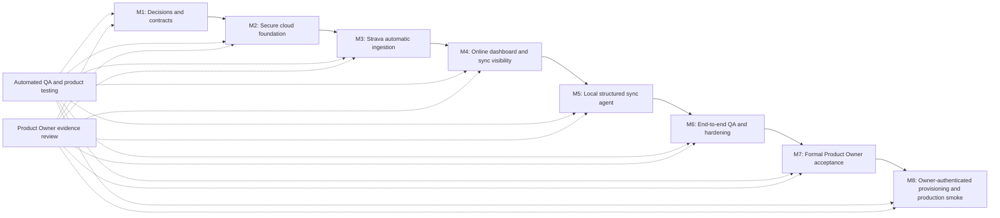

# Cloud Strava and Second Brain Sync Product Backlog

## Product Outcome

RacePredictor is available online for one athlete, receives activities automatically from Strava, retains the original provider payloads in private cloud object storage, and can use the latest explicitly selected structured Second Brain context even while the athlete's local computer is offline.

The cloud is authoritative for structured workouts, approved plans, calendars, and their revisions. The local Obsidian vault remains authoritative for qualitative Second Brain material. Only an allow-listed, validated, immutable, versioned snapshot of selected structured fields crosses from Obsidian into RacePredictor.

## MVP Success Signals

- A newly available Strava activity appears once in the authenticated online RacePredictor experience without a manual file import.
- The online dashboard remains usable when the local computer and Obsidian vault are unavailable.
- Every provider-derived activity can be traced to a private, checksum-verified raw payload in Cloudflare R2.
- The dashboard identifies activity freshness and Second Brain snapshot freshness separately and never presents stale local context as current.
- The single-athlete implementation enforces athlete ownership at every data, authentication, provider, storage, and repository boundary without exposing multi-athlete product controls.
- Existing plan approval and immutability rules remain intact, and a Second Brain snapshot cannot activate or modify a plan.
- Each milestone has automated quality evidence, product journey evidence, and recorded Product Owner acceptance before it is marked complete.

## Visual Milestone Plan

## Explicit MVP Scope

- One authenticated owner and one athlete in the product experience.
- Vercel Hobby for the online application, Neon Free for authoritative structured cloud data, and a private Cloudflare R2 bucket for raw provider payloads.
- Strava OAuth, historical bounded backfill, and webhook-driven create, update, delete, and deauthorization handling.
- Provider-neutral internal boundaries with Strava as the only implemented provider.
- Durable, idempotent ingestion; reconciliation with existing manual CSV/GPX activities; and separately visible ingestion status.
- Online dashboard reads from cloud-authoritative data and exposes provider and freshness status.
- Cursor-based cloud-to-local synchronization for structured activities, approved plans, calendars, and revisions needed by the local RacePredictor/Obsidian workflow.
- Local-to-cloud publication of selected structured Second Brain fields as immutable, versioned snapshots.
- Automated unit, contract, integration, migration, privacy, security-boundary, and critical-journey browser tests throughout delivery.

## Explicitly Out of Scope

- Additional athletes, invitations, athlete switching, coach collaboration, roles beyond the minimum owner-to-athlete access relationship, or public signup.
- Garmin Connect integration or Garmin-specific fields, metrics, UI, polling, credentials, or account management.
- Providers other than Strava.
- Uploading, browsing, searching, or synchronizing the complete Obsidian vault, arbitrary Markdown, attachments, local paths, or unselected notes.
- Automatic plan creation, approval, activation, adaptation, or medical/injury diagnosis from an activity or Second Brain snapshot.
- Native mobile applications, paid infrastructure, real-time streaming guarantees, app-owned push/SMS/WhatsApp/email delivery, or a public API/plugin ecosystem.
- Production ML model tuning, vector search, and multi-region or enterprise availability guarantees.

## Milestone 1 - Decisions, Boundaries, and Verifiable Contracts

Feature: Ratify Cloud and Local Authority Boundaries
Description: Record an implementable decision for online operation, authoritative data ownership, selected Second Brain publication, and future-athlete-safe boundaries before production code changes begin.
Priority: High
Area: Architecture decisions and product contracts
Reason: Every later slice depends on an unambiguous boundary between cloud-owned structured state and local qualitative context.
Acceptance Criteria:
- An approved architecture decision states that Neon is authoritative for structured activities, approved plans, calendars, and revisions, while Obsidian is authoritative for qualitative Second Brain source material.
- The decision states that RacePredictor receives only allow-listed structured Second Brain fields in immutable versioned snapshots, never the complete vault.
- The decision identifies Vercel Hobby, Neon Free, and private Cloudflare R2 as the MVP runtime services and documents their free-tier constraints and fallback behavior.
- The decision states that Strava is the only implemented provider while provider boundaries remain extensible.
- The decision states that only one athlete is exposed in the MVP product while all owned records and access paths remain athlete-scoped.
- Architecture, API, schema, privacy, deployment, rollback, and observability documents are identified for update by the stories that change them.
- Automated documentation checks or an equivalent review prove that the new decision does not silently conflict with the accepted local Phase 1 plan safety boundaries.
Dependencies:
- User-approved cloud, Strava, storage, Second Brain, single-athlete, and free-tier requirements
Risks:
- Older documents defer automatic integrations and authentication; unqualified language could cause teams to implement against superseded scope.

Feature: Define Additive Cloud, Provider, Sync, and Snapshot Contracts
Description: Specify the minimum versioned data and API contracts required for online authentication, Strava ingestion, local synchronization, and selected Second Brain publication.
Priority: High
Area: Shared contracts and versioned API
Reason: Stable contracts allow cloud, local agent, dashboard, and tests to progress independently without coupling to Strava-specific storage shapes.
Acceptance Criteria:
- New external endpoints remain under `/api/v1` and follow the existing additive-only compatibility rule and standard error envelope.
- Contracts cover owner session state, provider connection start/callback/status/disconnect, webhook validation/receipt, ingestion status, activity reads, cursor-based sync changes, bounded initial backfill, local-device registration/revocation, raw-object access by authorization, snapshot publication, and latest snapshot status.
- A provider adapter contract separates provider-specific identifiers and payloads from canonical activities.
- The selected Second Brain snapshot contract requires schema version, athlete identity, monotonic revision, publication timestamp, deterministic content hash, and the explicitly selected structured field set.
- The snapshot contract rejects unknown top-level fields, credentials, executable content, local filesystem paths, raw vault files, and attachments.
- Contracts preserve the rule that importing or publishing context cannot approve, activate, or mutate an approved plan.
- Contract tests include valid, invalid, unsupported-version, replay, stale-revision, cross-athlete, and oversized-payload cases.
Dependencies:
- Ratify Cloud and Local Authority Boundaries
- Existing `/api/v1`, coaching context, plan proposal, and plan approval contracts
Risks:
- An overly broad snapshot schema could become an accidental full-vault synchronization channel.

Feature: Establish Milestone Evidence and Product Acceptance Protocol
Description: Make progress visible and require objective implementation, automated QA, product testing, and Product Owner evidence at every milestone.
Priority: High
Area: Delivery governance and product acceptance
Reason: The user requires milestone feedback and Product Owner sign-off before any milestone is represented as complete.
Acceptance Criteria:
- A single visual milestone tracker records each milestone as Not started, In progress, Blocked, Ready for PO review, or Accepted.
- Every milestone report lists delivered scope, requirements evidence, automated checks and results, product journeys exercised, unresolved risks, free-tier usage observations, and rollback readiness.
- A milestone cannot move to Accepted until all of its stories meet acceptance criteria or an exception is explicitly recorded with impact and Product Owner decision.
- Product testing begins with the first executable slice and expands cumulatively through later milestones rather than being deferred to release.
- Test fixtures, logs, screenshots, and reports contain no private athlete data, provider tokens, vault content, or cloud credentials.
- The final release decision references evidence from every prior milestone and the final requirements sign-off checklist in this backlog.
Dependencies:
- Ratify Cloud and Local Authority Boundaries
Risks:
- Progress can appear green while product journeys are broken if reporting records only low-level test results.

### Milestone 1 Product Owner Acceptance Gate

- [ ] Authority boundaries match every user-approved requirement and preserve existing plan safety rules.
- [ ] MVP and out-of-scope boundaries are explicit enough to reject Garmin-specific, multi-athlete UI, paid-service, or whole-vault expansion.
- [ ] API and snapshot contracts are versioned, additive, testable, and privacy-bounded.
- [ ] The visual tracker and milestone evidence template exist and show truthful status.
- [ ] Automated contract/document checks pass.
- [ ] Product Owner decision and evidence link are recorded before Milestone 1 is marked Accepted.

## Milestone 2 - Cloud-Compatible Foundation

Feature: Build Reproducible Cloud-Compatible Environments
Description: Establish locally and in CI the Vercel-, Neon-, and R2-compatible configuration, migration, storage, and deployment boundaries without requiring external accounts or production credentials.
Priority: High
Area: Application runtime, database, object storage, and release configuration
Reason: Cloud behavior must be implementation- and test-ready before owner-dependent external provisioning is attempted.
Acceptance Criteria:
- The application has a production-mode build and health endpoint compatible with Vercel Hobby without requiring a live Vercel account to test.
- Database configuration supports pooled runtime access and a separate explicit migration path compatible with Neon; migrations never run implicitly on every application start.
- An object-storage adapter behaves like private S3-compatible R2 storage and is exercised locally or with a deterministic test double that forbids anonymous listing and reads.
- Environment boundaries prevent development and preview configuration from referencing production provider credentials, athlete data, object keys, or device credentials.
- Required secret names, owners, rotation procedure, and local/test substitutes are documented without storing secret values in Git.
- Build, migration, feature-disable, and rollback procedures are exercised in local or ephemeral test infrastructure and retain evidence.
- Vercel Hobby, Neon Free, R2, and Strava free-tier assumptions and measurable warning thresholds are documented for later production verification.
Dependencies:
- Milestone 1 accepted
- Local and CI runtime dependencies
Risks:
- Local and test doubles can drift from external service behavior; Milestone 8 must verify the documented assumptions against real services.

Feature: Add Owner Authentication and Athlete-Scoped Authorization
Description: Protect online health and coaching data with one owner login while establishing the ownership seams required for future athletes.
Priority: High
Area: Authentication, authorization, persistence, and repositories
Reason: Moving local health and coaching data online requires authenticated access and consistent athlete scoping before any provider data is accepted.
Acceptance Criteria:
- An unauthenticated visitor cannot read or mutate activities, plans, calendars, sync data, provider connections, raw-object links, or Second Brain snapshots.
- The MVP creates or maps one owner User, one Athlete, and one AthleteAccess relationship without exposing signup, invitations, roles management, or athlete switching.
- Every owned cloud entity added by this programme carries an `athleteId`, directly or through an enforced parent relationship.
- Every repository and application operation receives authenticated actor and athlete scope; no runtime path depends on a global `athlete_001` constant.
- Authorization tests prove that an actor without access to a second synthetic athlete cannot read, mutate, infer existence of, or obtain signed object access for that athlete's records.
- Session, device, and provider tokens are encrypted or securely hashed as appropriate, are revocable, and never appear in application logs or client-visible payloads.
- Authentication and authorization failures use stable, non-disclosing error responses and do not fall back to local unauthenticated behavior in production.
Dependencies:
- Build Reproducible Cloud-Compatible Environments
- Define Additive Cloud, Provider, Sync, and Snapshot Contracts
Risks:
- Existing local runtime assumptions may bypass actor scope unless repository entry points are audited comprehensively.

Feature: Create Athlete-Scoped Cloud Persistence and Migrations
Description: Add the minimum cloud records for users, athlete access, provider connections, durable ingestion, raw-object references, sync changes, paired devices, and Second Brain snapshots while preserving existing canonical activity and plan models.
Priority: High
Area: Neon schema and persistence
Reason: Durable and correctly scoped state is required before OAuth, webhooks, dashboard reads, or synchronization can be trusted.
Acceptance Criteria:
- Migrations add the minimum required cloud entities without replacing the existing canonical Activity, ActivitySplitKm, WeeklyFeature, plan, and calendar concepts.
- Provider activity uniqueness includes athlete, provider, and provider activity identifier; retries cannot create duplicate source references.
- Raw objects are referenced by athlete, provider, object key, content type, byte size, checksum, capture time, and processing status without storing raw payload bodies in Neon.
- Ingestion events/jobs have durable status, attempt count, next-attempt or terminal state, and diagnostic codes that exclude secrets and raw private payloads.
- Sync changes have a monotonic athlete-scoped cursor and are append-only for changes a local device must observe.
- Second Brain snapshots are immutable, unique by athlete and revision/content hash as appropriate, and expose one separately recorded latest-active pointer or query result.
- Migration and persistence integration tests cover forward migration, constraints, idempotent replay, transaction rollback, cross-athlete isolation, and compatibility with the accepted local Phase 1 dataset.
Dependencies:
- Add Owner Authentication and Athlete-Scoped Authorization
- Define Additive Cloud, Provider, Sync, and Snapshot Contracts
Risks:
- Retrofitting athlete ownership onto existing records can orphan or incorrectly associate historical local data.

### Milestone 2 Product Owner Acceptance Gate

- [ ] The production-mode shell and health check work locally or in isolated CI without external accounts.
- [ ] Anonymous and cross-athlete access attempts fail in automated and product-level tests.
- [ ] Existing local Phase 1 journeys and data remain intact after migrations.
- [ ] Secret values are absent from source control, logs, screenshots, and fixtures; required production secret names are documented for Milestone 8.
- [ ] Local/CI build, migration, feature-disable, and rollback evidence is recorded, including free-tier assumptions to verify later.
- [ ] Product Owner decision and evidence link are recorded before Milestone 2 is marked Accepted.

## Milestone 3 - Strava Automatic Ingestion

Feature: Connect and Revoke the Owner's Strava Account
Description: Let the authenticated owner connect one Strava account through OAuth, view truthful connection state, request bounded history, and disconnect safely.
Priority: High
Area: Strava provider connection
Reason: A secure provider connection is the user-facing entry point for automatic activity ingestion.
Acceptance Criteria:
- Only the authenticated owner with access to the athlete can start and complete the Strava OAuth flow.
- OAuth state, redirect target, granted scopes, provider athlete identifier, token expiry, and callback errors are validated and handled without exposing credentials.
- Refresh credentials are encrypted at rest, rotated when Strava returns replacements, and never returned to the browser or logs.
- The dashboard shows Connected, Action required, Disconnected, and Error states with last successful provider contact time.
- The owner can request a bounded historical backfill with visible date/range limits and progress rather than an unbounded import.
- Disconnect revokes local credentials and stops new provider processing while retaining canonical activity history and raw payload audit records.
- Deauthorization from Strava produces the same safe disconnected outcome and an actionable status in RacePredictor.
- Automated tests cover successful callback, denied consent, invalid or replayed state, insufficient scope, refresh rotation/failure, disconnect, and deauthorization.
Dependencies:
- Milestone 2 accepted
- Deterministic Strava OAuth/provider test adapter and synthetic fixtures
Risks:
- Strava application mode, athlete limits, scopes, and rate limits can block connection or backfill.

Feature: Receive and Persist Strava Webhook Events Durably
Description: Validate Strava subscription requests and persist relevant activity lifecycle events before acknowledging them for asynchronous processing.
Priority: High
Area: Webhooks and ingestion event log
Reason: Fast, durable receipt prevents event loss and keeps external callbacks independent of slower provider fetches and normalization.
Acceptance Criteria:
- The webhook endpoint completes Strava subscription validation using an environment-scoped verification token.
- Relevant create, update, delete, and deauthorization events are stored before successful acknowledgement and linked to the resolved athlete-scoped provider connection.
- Duplicate deliveries resolve to the same durable event identity or an equivalent idempotent state and do not create additional canonical activities.
- Unknown, malformed, unauthorized, or unresolvable events are rejected or quarantined with non-sensitive diagnostic evidence according to the documented contract.
- Webhook receipt does not fetch full activity details, normalize data, or wait on the local computer before acknowledgement.
- Acknowledgement latency is measured and meets the documented Strava callback requirement under an automated integration test.
- Failed downstream processing remains discoverable and retryable after application restart or deployment.
Dependencies:
- Connect and Revoke the Owner's Strava Account
- Create Athlete-Scoped Cloud Persistence and Migrations
Risks:
- Incorrect provider-connection resolution can route health data to the wrong athlete unless uniqueness and authorization rules are enforced.

Feature: Fetch and Retain Immutable Raw Strava Payloads
Description: Process durable ingestion work by fetching only the activity detail, laps, and streams required for canonical behavior and retaining the original responses privately in R2.
Priority: High
Area: Provider processing and raw object storage
Reason: Raw source retention provides traceability and reprocessing without bloating the structured database.
Acceptance Criteria:
- Processing refreshes an expired token safely and respects documented Strava rate-limit responses and retry timing.
- Only provider endpoints and fields needed by the approved canonical activity, split, route, and provenance behavior are requested.
- Each successful provider response is stored as a private, athlete/provider-namespaced, content-addressed or otherwise immutable R2 object with checksum and byte-size metadata in Neon.
- A repeated identical response reuses or safely records the same content without uncontrolled duplicate storage.
- Checksum verification detects incomplete or altered upload/download content and prevents it from being treated as successfully processed.
- Raw objects are never exposed through public URLs; any download path requires current athlete authorization and a short-lived access mechanism.
- Processing can be retried after partial fetch or object-store failure without losing the durable event or creating a duplicate canonical activity.
- Automated tests use synthetic payloads and cover rate limit, token refresh, partial response, R2 failure, checksum mismatch, and replay.
Dependencies:
- Receive and Persist Strava Webhook Events Durably
- Private R2-compatible object-storage adapter and synthetic provider fixtures
Risks:
- Streams can consume the free storage allowance quickly; unnecessary fields or duplicate objects would shorten free-tier viability.

Feature: Normalize Strava Activities Idempotently and Reconcile Manual Imports
Description: Convert retained Strava source data into existing canonical models and reconcile it with prior CSV/GPX records without losing source traceability.
Priority: High
Area: Canonical ingestion, deduplication, and analytics
Reason: Automatic ingestion provides value only when it produces trustworthy, non-duplicated dashboard data compatible with existing history.
Acceptance Criteria:
- Strava details normalize into existing canonical Activity, ActivitySplitKm, optional RouteSignature, and affected WeeklyFeature behavior without introducing Garmin-specific fields.
- Canonical records retain separate provider/file source references so one activity can be traced to every matched source.
- Provider identifier uniqueness and deterministic cross-source reconciliation prevent webhook retries, backfill overlap, and prior CSV/GPX imports from creating duplicate canonical activities.
- An ambiguous cross-source match is reported for review and does not silently merge or duplicate data.
- A provider update creates an auditable canonical revision or equivalent documented change record and recomputes only affected derived data.
- A provider deletion or deauthorization follows a documented retention rule, preserves required audit provenance, and never deletes an approved plan or unrelated canonical record.
- Successful canonical mutation appends an athlete-scoped sync change for eligible local devices.
- Unit and integration tests cover create, update, delete, retry, backfill/webhook overlap, manual-import overlap, ambiguous match, transaction rollback, and affected analytics recomputation.
Dependencies:
- Fetch and Retain Immutable Raw Strava Payloads
- Existing manual import, dedupe, activity, split, route, and weekly feature behavior
Risks:
- Source timestamps and privacy edits can make cross-format identity ambiguous; unsafe automatic merges would undermine history trust.

### Milestone 3 Product Owner Acceptance Gate

- [ ] Test-adapter journeys cover connect, status, bounded backfill, disconnect, reconnect, denied, expired, and revoked states without requiring owner credentials.
- [ ] Webhook create/update/delete/deauthorization fixtures persist durably and return within the required callback window.
- [ ] A synthetic provider lifecycle produces one traceable canonical activity with private checksum-verified raw objects.
- [ ] Backfill, webhook retry, and existing manual import overlap do not produce duplicate canonical activities.
- [ ] No provider credential or private payload appears in browser output, logs, fixtures, screenshots, database diagnostics, or source control.
- [ ] Strava rate-limit and application-capacity assumptions are recorded for production verification in Milestone 8.
- [ ] Product Owner decision and evidence link are recorded before Milestone 3 is marked Accepted.

## Milestone 4 - Online Dashboard and Sync Visibility

Feature: Expose Athlete-Scoped Change and Synchronization Status APIs
Description: Provide the cloud change feed and status projections needed by the online dashboard and later local sync agent without exposing another athlete's state.
Priority: High
Area: Cloud API, synchronization feed, and operational status
Reason: Online visibility and local synchronization need one stable, authorized source for changes and independent freshness signals.
Acceptance Criteria:
- An authenticated athlete-scoped endpoint returns bounded, cursor-based eligible changes in deterministic order and rejects invalid, stale, or foreign-athlete cursors safely.
- Initial backfill is separately bounded and cannot be used to bypass normal authorization or object-access rules.
- Status responses report provider connection, ingestion progress, activity freshness, paired-device freshness, and Second Brain snapshot freshness as separate fields.
- Status computation distinguishes Never available, Current, Stale, Retrying, Action required, and Unavailable according to documented objective rules.
- No response exposes provider tokens, device credentials, raw payload bodies, private object keys, local paths, or diagnostic stack traces.
- Contract and integration tests cover pagination, empty feed, replay, correction/deletion markers, cross-athlete denial, and independent freshness transitions.
Dependencies:
- Milestone 3 accepted
- Athlete-scoped sync-change persistence
Risks:
- Combining independent freshness signals into one status would hide stale Second Brain context behind current activity ingestion.

Feature: Serve the Authenticated Dashboard from Cloud-Authoritative Data
Description: Make the existing RacePredictor dashboard work online from Neon-backed APIs and show provider, activity, and Second Brain freshness truthfully.
Priority: High
Area: Online dashboard and cloud API reads
Reason: The central user outcome is an online RacePredictor that remains useful when the local computer is off.
Acceptance Criteria:
- The authenticated production dashboard loads existing activity, performance, plan, calendar, and Today data from cloud-authoritative APIs without reading the local SQLite database or Obsidian vault.
- The dashboard remains usable when the paired local device is offline; only local synchronization and new Second Brain publication are unavailable.
- Activity ingestion status shows last provider event, last successful canonical update, pending/failed work count, and an actionable connection or retry state without leaking diagnostics.
- Second Brain status separately shows latest snapshot revision, publication time, and Current, Stale, Never published, or Error state according to documented thresholds.
- The dashboard never labels an old Second Brain snapshot as freshly synchronized and never implies that a new activity was AI-reviewed or adapted.
- Loading, empty, authentication-required, provider-disconnected, stale, and service-error states have distinct recoverable behavior at supported desktop and responsive-baseline widths.
- Critical browser journeys prove online use with the local sync agent stopped and confirm existing explicit plan approval/version history behavior remains intact.
Dependencies:
- Normalize Strava Activities Idempotently and Reconcile Manual Imports
- Existing dashboard, plan, calendar, Today, and API contracts
Risks:
- Reusing local fallbacks in production could mask a broken cloud path and display outdated information.

### Milestone 4 Product Owner Acceptance Gate

- [ ] The online dashboard works with the local computer unavailable and accurately separates activity and Second Brain freshness.
- [ ] Cursor, backfill, correction/deletion, replay, and cross-athlete tests pass for cloud change and status APIs.
- [ ] Existing plan approval, calendar, Today, and manual-import safety behavior has no release-blocking regression.
- [ ] Automated unit, contract, integration, migration, privacy, and browser suites pass for the cumulative product.
- [ ] Product Owner decision and evidence link are recorded before Milestone 4 is marked Accepted.

## Milestone 5 - Local Structured Sync Agent

Feature: Pair and Revoke One Athlete-Scoped Local Sync Device
Description: Allow the owner to establish one revocable local agent identity for synchronization without reusing browser or provider credentials.
Priority: High
Area: Local device pairing and authorization
Reason: The local RacePredictor/Obsidian workflow needs bounded machine access that can be independently revoked if the device is lost or replaced.
Acceptance Criteria:
- Pairing requires an authenticated owner action and creates a device credential limited to the one athlete and approved sync purposes.
- The credential is shown only at the safe enrollment moment, is stored using the operating system's credential store, and is not written to the vault, repository, logs, or generated notes.
- The dashboard shows device name, paired time, last successful sync, and Active, Stale, Error, or Revoked status.
- Revocation immediately prevents new change reads, raw-object access, and snapshot publication without disconnecting Strava or invalidating browser sessions.
- Authentication failures do not reveal whether another athlete, snapshot, activity, or raw object exists.
- Automated tests cover pair, replayed enrollment, invalid credential, scope violation, rotation or re-pair, and revocation.
Dependencies:
- Milestone 4 accepted
- Owner authentication
Risks:
- A long-lived device secret stored in plain text would expose both health data and the context publication channel.

Feature: Synchronize Cloud-Authoritative Changes to the Local Projection
Description: Keep local SQLite and controlled generated Obsidian sections current from an athlete-scoped, replayable cloud change feed without overwriting user-authored notes.
Priority: High
Area: Cloud-to-local synchronization
Reason: Local Second Brain workflows need current activities and plans while the online service remains independent of local availability.
Acceptance Criteria:
- The agent performs a bounded initial backfill followed by cursor-based incremental reads for eligible activities, plans, calendars, revisions, and deletion/correction markers.
- A batch is applied to SQLite transactionally and advances the durable local cursor only after the complete batch succeeds.
- Retrying the same batch produces the same local result without duplicate records, duplicated generated sections, or a skipped cursor.
- Controlled generated Obsidian sections are regenerated atomically and are visibly identified as generated; user-authored Markdown outside those sections is never changed.
- A local outage of several days resumes from the saved cursor without requiring a full reset or losing cloud changes.
- A local failure does not roll back cloud ingestion, provider state, or the last successfully published Second Brain snapshot.
- Sync status distinguishes download success, local projection failure, and snapshot publication failure.
- Integration tests cover initial backfill, pagination, replay, partial failure, corrected/deleted activity, plan revision, offline recovery, and protection of user-authored note content.
Dependencies:
- Pair and Revoke One Athlete-Scoped Local Sync Device
- Athlete-scoped sync change feed
Risks:
- Uncontrolled Markdown rewriting could destroy the athlete's qualitative history even when structured synchronization succeeds.

Feature: Publish Only Selected Structured Second Brain Snapshots
Description: Let the local agent publish an explicitly selected, allow-listed structured context snapshot that the online dashboard can use independently of the local computer.
Priority: High
Area: Obsidian-to-cloud synchronization and context status
Reason: Online RacePredictor needs current selected context, but the complete private vault must remain local.
Acceptance Criteria:
- The publication input is built only from fields explicitly selected in local configuration and accepted by the versioned allow-list; no directory-wide or arbitrary-note upload path exists.
- The publisher shows or records the exact field categories and source-note references selected for a snapshot without including local filesystem paths in the cloud payload.
- The cloud validates schema version, athlete scope, size, field allow-list, revision ordering, content hash, timestamps, and prohibited content before storing anything.
- A successful publication creates a new immutable revision; it never overwrites or mutates an earlier snapshot.
- Replaying identical content is idempotent, while a stale or conflicting revision is rejected with a recoverable response.
- The latest valid snapshot remains available to the online dashboard when the local device is offline, revoked, or experiencing a later publication failure.
- The payload excludes complete Markdown notes, unselected fields, attachments, credentials, executable content, local paths, provider raw data, and Codex conversation history.
- Snapshot publication cannot create, approve, activate, replace, or edit a goal, plan prescription, calendar entry, activity, or provider connection.
- Automated privacy tests scan payloads and retained evidence, and browser/product tests prove the dashboard's current/stale/never-published/error states.
Dependencies:
- Synchronize Cloud-Authoritative Changes to the Local Projection
- Define Additive Cloud, Provider, Sync, and Snapshot Contracts
Risks:
- Incorrect selection defaults or permissive schema evolution could disclose qualitative notes the athlete did not intend to publish.

### Milestone 5 Product Owner Acceptance Gate

- [ ] Pair, initial sync, incremental sync, offline recovery, credential revocation, and re-pair product journeys pass.
- [ ] Replay and partial-failure tests prove no lost cursor, duplicate data, or cloud rollback.
- [ ] User-authored Obsidian content outside controlled generated sections remains byte-for-byte unchanged in test evidence.
- [ ] Only explicitly selected structured fields appear in immutable cloud snapshots; prohibited content scans pass.
- [ ] The online dashboard continues using the last valid snapshot while the local computer is offline and labels its age accurately.
- [ ] Product Owner decision and evidence link are recorded before Milestone 5 is marked Accepted.

## Milestone 6 - End-to-End QA and Hardening

Feature: Reconcile Missed Work and Expose Actionable Operations Status
Description: Detect and recover missed or failed ingestion and synchronization work within free-tier constraints while giving the owner truthful, actionable status.
Priority: High
Area: Reliability, observability, and free-tier guardrails
Reason: Webhooks, serverless executions, provider calls, and a sometimes-offline local device all fail independently and require durable recovery.
Acceptance Criteria:
- A scheduled reconciliation process identifies persisted provider events or jobs that are missing, stale, retryable, or terminal and safely resumes eligible work.
- Reconciliation is idempotent and cannot duplicate canonical activities, raw objects, sync changes, or snapshot revisions.
- Retry limits and terminal states prevent infinite free-tier consumption and retain a non-sensitive reason plus a supported owner action.
- The dashboard distinguishes healthy, delayed, retrying, action-required, and service-unavailable states for provider ingestion and local synchronization.
- Storage, database, invocation, bandwidth, and provider-rate usage have documented measurable warning thresholds below free-tier or provider limits.
- Exceeding a guardrail degrades safely, preserves already accepted data, and does not silently enable paid usage or discard raw payloads.
- Automated fault tests cover missed webhook simulation, worker interruption, rate limit, Neon/R2 unavailability, scheduled retry, terminal failure, and successful recovery.
Dependencies:
- Milestone 5 accepted
- Durable event/job and status records
Risks:
- Platform cron frequency and free-tier allowances may be insufficient for a chosen recovery target and must not be presented as an uptime guarantee.

Feature: Validate Shadow Reconciliation and Release-Candidate Rollback
Description: Compare synthetic automatic ingestion with representative privacy-safe local history and prove discrepancy handling and rollback before any external production cutover.
Priority: High
Area: Data migration rehearsal, reconciliation, and rollback
Reason: A credential-free release-candidate rehearsal reduces the risk of duplicates, missing history, or plan disruption before owner-dependent production work.
Acceptance Criteria:
- A bounded synthetic backfill reports requested, fetched, retained, normalized, duplicate, ambiguous, rejected, and failed counts.
- Representative activities are compared across Strava and existing CSV/GPX sources for identity, timing, distance, duration, splits where available, and affected weekly aggregates.
- Every discrepancy is resolved or recorded as a release-candidate block; no unexplained discrepancy is silently ignored.
- Existing approved goals, immutable plan versions, calendar audit history, Today behavior, and reminder preferences survive migration and remain linked to the correct athlete.
- A feature-controlled rollback stops provider processing and restores the prior application path without deleting accepted cloud or local records.
- A backup/recovery rehearsal, privacy scan, security-boundary test, and local critical product journey pass before the release candidate is submitted to Product Owner review.
Dependencies:
- Reconcile Missed Work and Expose Actionable Operations Status
- Representative synthetic Strava, CSV, and GPX fixtures
Risks:
- Real production history may expose differences not represented by privacy-safe fixtures; Milestone 8 production smoke must remain bounded and reversible.

Feature: Complete Cumulative Automated QA and Product Testing
Description: Prove the credential-free release candidate end to end against this backlog before formal Product Owner acceptance.
Priority: High
Area: Cross-cutting quality and release readiness
Reason: Online health data, authorization, external providers, synchronization, and plan safety require evidence beyond isolated implementation tests.
Acceptance Criteria:
- Lint, typecheck, build, unit, contract, migration, persistence integration, provider integration, sync integration, privacy/security, and critical browser suites pass for every touched workspace.
- Browser tests cover authenticated online use, Strava connect/status/disconnect, ingestion status, activity visibility, local-offline behavior, snapshot freshness, plan immutability, and recoverable failure states at desktop and responsive-baseline widths.
- Product tests cover a full synthetic journey from Strava event through private raw retention, canonical activity, dashboard display, cloud-to-local sync, selected snapshot publication, and online use with the local device offline.
- No test or evidence artifact contains real athlete data, Obsidian note content, provider tokens, device tokens, session secrets, or cloud credentials.
- Architecture, API, schema, privacy, deployment, rollback, UX, roadmap, and progress documentation matches delivered behavior and known limitations.
- Milestones 1 through 5 have recorded Product Owner decisions, and any accepted gap identifies user impact, workaround, owner, and follow-up scope.
- A release-candidate evidence pack maps every final checklist item to an automated result, product-test result, document, or explicit Milestone 8 production dependency.
Dependencies:
- Milestones 1 through 5 accepted
Risks:
- External service availability cannot be guaranteed by repository automation; controlled test doubles plus a scoped production smoke test are both required.

### Milestone 6 Product Owner Acceptance Gate

- [ ] Missed and failed work recovers safely or reaches a truthful action-required state.
- [ ] Free-tier guardrails are measurable and no paid service or automatic spend has been enabled.
- [ ] Synthetic shadow/backfill evidence accounts for duplicates, ambiguous matches, rejects, failures, and retained raw objects.
- [ ] Migration and rollback rehearsals preserve accepted local history, approved plans, calendars, and reminder preferences.
- [ ] The cumulative automated gate and full synthetic product journey pass with privacy-safe evidence.
- [ ] The release-candidate evidence pack identifies only external provisioning and production smoke as Milestone 8 dependencies.
- [ ] Product Owner decision and evidence link are recorded before Milestone 6 is marked Accepted.

## Milestone 7 - Formal Product Owner Acceptance

Feature: Complete Formal Product Owner Requirements Review
Description: Review the complete credential-free release candidate against the approved requirements and decide whether it is ready for owner-authenticated provisioning and production smoke.
Priority: High
Area: Product acceptance and release authorization
Reason: The user requires Product Owner sign-off against requirements before the implementation can proceed to its final external production step.
Acceptance Criteria:
- The Product Owner reviews every item in the final requirements sign-off checklist against linked implementation, automated QA, product-test, privacy, rollback, and documentation evidence.
- Every non-production requirement is marked Pass or Blocked; no item is accepted solely because implementation reports it complete.
- Each requirement that can only be proven with external services is marked Ready for production verification and linked to a specific bounded Milestone 8 smoke check.
- Any accepted gap records user impact, workaround, risk, owner, and follow-up scope; an unaccepted release-blocking gap produces a Blocked decision.
- The Product Owner records an Accepted for production verification or Blocked decision, role/name, date, evidence links, and accepted gaps.
- Milestone 8 cannot begin until the Product Owner decision is Accepted for production verification.
Dependencies:
- Milestone 6 accepted
- Complete release-candidate evidence pack
Risks:
- Treating production-dependent checks as already passed would make the acceptance decision misleading.

### Milestone 7 Product Owner Acceptance Gate

- [ ] Every approved requirement is mapped to objective evidence or an explicit Milestone 8 production smoke check.
- [ ] Automated QA, product testing, privacy, rollback, and documentation evidence has been independently reviewed.
- [ ] Release-blocking gaps are resolved; accepted gaps include impact and follow-up ownership.
- [ ] The Product Owner records Accepted for production verification or Blocked with name/role, date, and evidence links.
- [ ] Milestone 7 is not marked Accepted when the Product Owner decision is Blocked.

## Milestone 8 - External Provisioning and Production Smoke

Feature: Provision Owner-Authenticated Free-Tier Services
Description: With the owner's authentication at the point required, provision and connect the real Vercel Hobby, Neon Free, private Cloudflare R2, and Strava application resources from the accepted release candidate.
Priority: High
Area: External accounts, production configuration, and deployment
Reason: Real service setup requires owner authority and must be deferred until all credential-free implementation and formal Product Owner acceptance are complete.
Acceptance Criteria:
- Implementation pauses for user action only when authentication, consent, account choice, credential creation, DNS ownership, or equivalent external authority is actually required.
- Production and non-production Vercel, Neon, R2, and Strava configuration are isolated and match the approved environment model.
- R2 anonymous listing and reads fail, Neon migrations run once through the explicit release path, and the Vercel health endpoint reports the deployed release.
- Production secrets are entered through service secret stores, have documented owners and rotation paths, and never enter Git, chat output, logs, screenshots, or fixtures.
- Strava callback and webhook URLs, verification, granted scopes, application mode, athlete capacity, and rate-limit observations match the single-athlete MVP assumptions.
- Free-tier usage and warning thresholds are verified against the provisioned services; no paid plan, automatic upgrade, or automatic spend is enabled.
Dependencies:
- Milestone 7 accepted for production verification
- Owner authentication and consent for Vercel, Neon, Cloudflare, Strava, and DNS only where required
Risks:
- External account restrictions, terms, quotas, or DNS propagation may block production verification without invalidating the accepted release-candidate implementation.

Feature: Run Bounded Production Smoke and Complete the Programme
Description: Exercise the minimum real-service journey, verify rollback, and record final production evidence without broad or destructive backfill.
Priority: High
Area: Production verification and completion
Reason: Test doubles cannot prove OAuth, webhook delivery, private object storage, cloud availability, or real free-tier behavior.
Acceptance Criteria:
- The owner authenticates to RacePredictor, connects Strava, and a bounded activity or approved test activity completes webhook/backfill receipt, private raw retention, canonical normalization, and one-time dashboard display.
- The production dashboard works while the local sync agent is stopped and reports activity and Second Brain freshness independently.
- A paired local device completes one bounded cloud-to-local sync and publishes one explicitly selected structured snapshot; the dashboard retains and ages it correctly after the agent stops.
- Production authorization checks prevent anonymous, revoked-device, and synthetic foreign-athlete access, including signed raw-object access.
- A rollback/feature-disable check stops new provider processing without deleting accepted cloud activities, plans, snapshots, or raw audit objects.
- Production evidence contains no credential values, raw private payload bodies, complete Obsidian notes, or unnecessary athlete data.
- The Product Owner reviews only the Milestone 8 production-dependent evidence, records Pass or Blocked, and confirms that prior acceptance remains valid before the programme is marked complete.
Dependencies:
- Provision Owner-Authenticated Free-Tier Services
- Owner-approved bounded production activity and selected snapshot fields
Risks:
- Real provider data is private; smoke evidence must minimize and redact it while remaining objectively verifiable.

### Milestone 8 Product Owner Acceptance Gate

- [ ] Required external services are provisioned on free tiers with isolated secrets and no automatic spend.
- [ ] Real OAuth, webhook, Neon, private R2, online dashboard, paired-device sync, and selected-snapshot smoke checks pass.
- [ ] Production use with the local device offline and truthful independent freshness states is verified.
- [ ] Feature-disable/rollback behavior is verified without destructive data loss.
- [ ] Production evidence is privacy-safe and all remaining checklist items are Pass.
- [ ] The Product Owner records final Pass or Blocked before the programme is marked complete.

## Product Assumptions

- The current accepted local Phase 1 behavior remains a compatibility baseline; this programme changes the automatic-ingestion and online-runtime deferrals only where the user has now explicitly approved them.
- One owner authentication flow and one athlete experience are sufficient for the MVP; future athlete support requires a separate product, privacy, capacity, and operational review.
- `athleteId` scoping, User/Athlete/AthleteAccess separation, provider-connection ownership, repository authorization, device scope, and R2 namespacing are required now even though multi-athlete screens are not.
- Cloudflare R2 is the approved cloud storage interpretation for raw provider payload retention.
- Selected structured Second Brain fields will be configured through an explicit local allow-list. No field is uploaded merely because it appears in an Obsidian note.
- Cloud-to-local and local-to-cloud directions are independently retryable: a failure in one direction does not undo success in the other.
- External authentication, account choice, consent, DNS control, and credential setup require the user's intervention only in Milestone 8; implementation proceeds with privacy-safe fixtures and test adapters through Milestone 7.

## Prioritisation Summary

- Authority, contracts, evidence rules, authentication, and athlete scoping come first because they prevent privacy and ownership defects from spreading into provider and synchronization code.
- Strava connection and durable event receipt precede normalization so provider retries and outages cannot lose or duplicate work.
- Raw retention and canonical reconciliation precede dashboard cutover so online data remains traceable and compatible with accepted manual history.
- The local sync projection precedes Second Brain publication so cloud-authoritative context and local qualitative context retain a clear one-way boundary in each direction.
- Reconciliation, free-tier guardrails, shadow comparison, cumulative QA, and formal Product Owner review precede owner-dependent external provisioning.
- External provisioning and production smoke are last so authentication interrupts the user only after the release candidate is accepted for production verification.

## Recommended Next Item

Feature: Ratify Cloud and Local Authority Boundaries

This is the next implementation-ready item because it resolves the approved change from local-only to online operation, preserves existing plan safety rules, and establishes the source-of-truth and privacy decisions required by every code and deployment story.

## Final Requirements Sign-Off Checklist

Release status: **Milestone 7 accepted for production verification; Milestone 8 production verification pending**

- [ ] RacePredictor is online and authenticated on Vercel Hobby.
- [ ] Structured cloud data is authoritative in Neon Free and remains usable while the local computer is offline.
- [ ] Strava is the only implemented automatic activity provider.
- [ ] Activity create, update, delete, deauthorization, retry, and bounded backfill behaviors are durable and idempotent.
- [ ] Raw Strava payloads are retained privately in Cloudflare R2 with checksum-verifiable provenance.
- [ ] Existing CSV/GPX history reconciles without unexplained duplicates or silent unsafe merges.
- [ ] Only one athlete is exposed in the MVP product experience.
- [ ] User, athlete, access, repository, provider, device, sync, snapshot, and object-storage boundaries permit future athletes without a data-model or authorization rearchitecture.
- [ ] No Garmin-specific integration, credential, metric, field, or UI was added.
- [ ] Obsidian remains local and authoritative for qualitative Second Brain source material.
- [ ] RacePredictor receives only explicitly selected structured Second Brain fields through immutable versioned snapshots.
- [ ] The complete vault, arbitrary notes, attachments, local paths, credentials, executable content, and Codex conversation history are not uploaded.
- [ ] Cloud-owned activities, plans, calendars, and revisions synchronize safely to the local projection without overwriting user-authored notes.
- [ ] Second Brain snapshot status and activity ingestion status are separately visible and truthfully stale when appropriate.
- [ ] Context publication cannot create, approve, activate, adapt, or mutate an approved plan.
- [ ] Existing explicit plan approval, immutable version history, calendar audit, Today, and reminder safety behaviors remain intact.
- [ ] Free-tier guardrails are active and no paid service or automatic spend is enabled.
- [ ] Automated QA ran throughout every milestone and the cumulative gate is green.
- [ ] Product testing ran throughout every milestone and includes the complete online/offline synchronization journey.
- [ ] Privacy-safe evidence, deployment/rollback evidence, known limitations, and accepted gaps are documented.
- [ ] Milestones 1 through 6 have recorded Product Owner acceptance decisions, Milestone 7 has formal release-candidate acceptance, and Milestone 8 has final production verification.
- [ ] Product Owner final decision: **Pending / Accepted / Blocked**.
- [ ] Product Owner name or role, decision date, evidence links, and any accepted gaps are recorded before the programme is marked complete.
